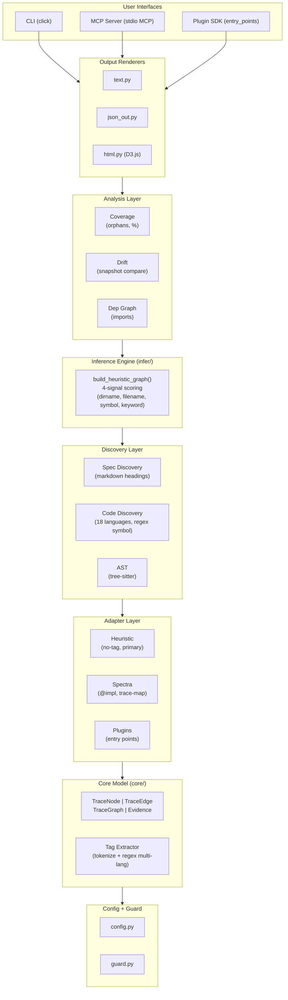
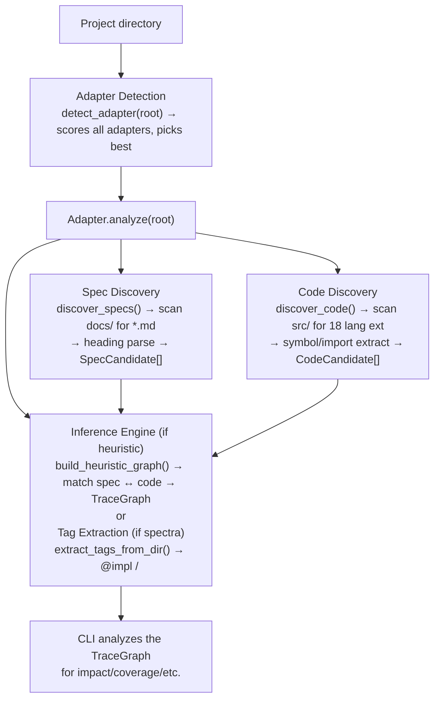
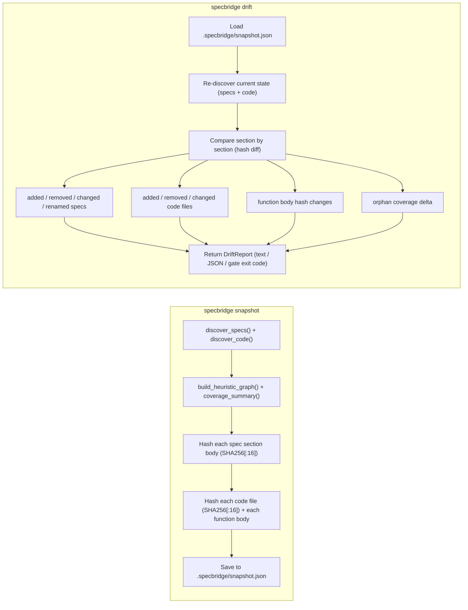
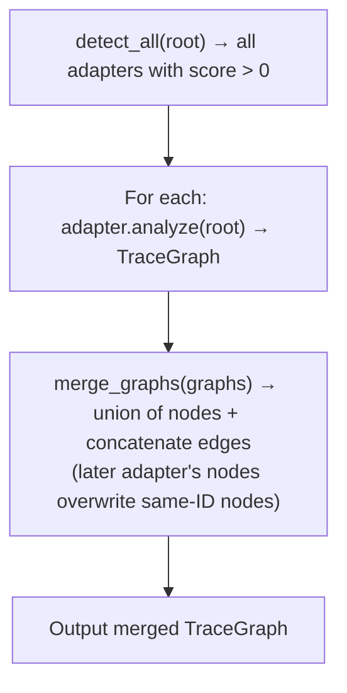

# Architecture Overview

> **Date:** 2026-07-26
> **Version:** 0.0.1.dev0

## 1. Purpose

specbridge is a **framework-agnostic, read-only traceability analyzer** that maps relationships between specifications and source code. It never modifies specs or code — all output goes to `.specbridge/`.

## 2. High-Level Architecture



## 3. Module Responsibilities

| Module | Responsibility | Key Exports |
|--------|---------------|-------------|
| `core/` | Data model definitions, tag extraction from files | `TraceNode`, `TraceEdge`, `TraceGraph`, `Tag`, `extract_tags_from_dir()` |
| `adapters/` | Framework-specific project analysis, plugin discovery | `ProjectAdapter`, `detect_adapter()`, `merge_graphs()`, `register()` |
| `discovery/` | Parse specs (markdown) and code (multi-language) into candidates | `SpecCandidate`, `CodeCandidate`, `discover_specs()`, `discover_code()` |
| `infer/` | Heuristic matching between specs and code candidates | `build_heuristic_graph()` |
| `analyzers/` | Coverage stats, orphan detection, drift comparison, dependency graph | `coverage_summary()`, `find_orphan_*()`, `compute_drift()`, `build_code_dependency_graph()` |
| `outputs/` | Render `TraceGraph` as text, JSON, or interactive HTML | `render_text()`, `render_json()`, `render_html()` |
| `cli.py` | Click-based CLI entry point | `cli` group, 9 commands |
| `mcp_server.py` | MCP protocol server for AI agent integration | `create_mcp_server()`, `run_mcp_server()` |
| `config.py` | Project configuration from `.specbridge.yaml` / `pyproject.toml` | `SpecbridgeConfig.load()` |
| `guard.py` | Validate write paths stay inside `.specbridge/` | `validate_write_path()` |

## 4. Data Flow

### Read Path (primary flow)



### Snapshot / Drift Flow



### Adapter Merge Flow



## 5. Key Design Principles

| Principle | Implementation |
|-----------|---------------|
| **Read-only** | `guard.py` blocks any write outside `.specbridge/`. Snapshot/drift output only goes to `.specbridge/snapshot.json`. |
| **Framework-agnostic** | Adapter pattern with `ProjectAdapter` ABC. Built-in: heuristic + spectra. Extensible via `entry_points` plugin discovery. |
| **No-tag-first** | HeuristicAdapter is primary (always loaded first). Tag-based adapters are optional extras that add explicit edges on top. |
| **Multi-language** | 18 languages supported via regex symbol extraction. Python optionally uses tree-sitter AST for accuracy. |
| **Confidence scoring** | Every edge has `EdgeStrength` (EXPLICIT > INFERRED > WEAK) and source evidence. Users see *why* a relationship was inferred. |
| **Hash-based drift** | 3-layer hashing: file-level, function-level, section-level. Only changed items are reported (no full re-scan). |

## 6. Dependencies

### Runtime
- `click>=8.1` — CLI framework
- `rich>=13.0` — Terminal formatting
- `pyyaml>=6.0` — YAML config

### Optional
- `watchdog>=4.0` — `specbridge watch` command
- `mcp>=1.0` — MCP server
- `tree-sitter>=0.21`, `tree-sitter-python>=0.21` — AST-based Python analysis

### Dev
- `pytest`, `pytest-cov`, `mypy`, `ruff`, `types-PyYAML`

## 7. File Layout

```
specbridge/
├── __init__.py          # Version
├── cli.py               # CLI: 9 commands
├── config.py            # Config loading
├── guard.py             # Write path guard
├── mcp_server.py        # MCP protocol server
├── adapters/
│   ├── __init__.py      # Re-exports + eager import
│   ├── _base.py         # ABC + registry + plugin discovery + merge
│   ├── heuristic.py     # HeuristicAdapter
│   └── spectra.py       # SpectraAdapter
├── analyzers/
│   ├── __init__.py      # coverage_summary, orphan detection
│   ├── drift.py         # Snapshot + drift engine
│   └── graph.py         # Code dependency graph
├── core/
│   ├── __init__.py      # Data model (TraceNode, TraceEdge, TraceGraph, enums)
│   └── extract.py       # Tag extraction (tokenize + regex)
├── discovery/
│   ├── __init__.py
│   ├── ast.py           # Tree-sitter AST (Python)
│   ├── code.py          # Code discovery (18 lang)
│   └── spec.py          # Spec discovery (markdown headings)
├── infer/
│   └── __init__.py      # Heuristic graph builder
└── outputs/
    ├── __init__.py
    ├── html.py          # D3.js HTML output
    ├── json_out.py      # JSON output
    └── text.py          # Text output
tests/
├── __init__.py
├── conftest.py
├── test_adapter_merge.py
├── test_analyzers.py
├── test_ast.py
├── test_boundary.py
├── test_code_discovery.py
├── test_config.py
├── test_drift.py
├── test_extract.py
├── test_guard.py
├── test_heuristic_adapter.py
├── test_import_graph.py
├── test_plugin_discovery.py
└── test_spectra_adapter.py
```
