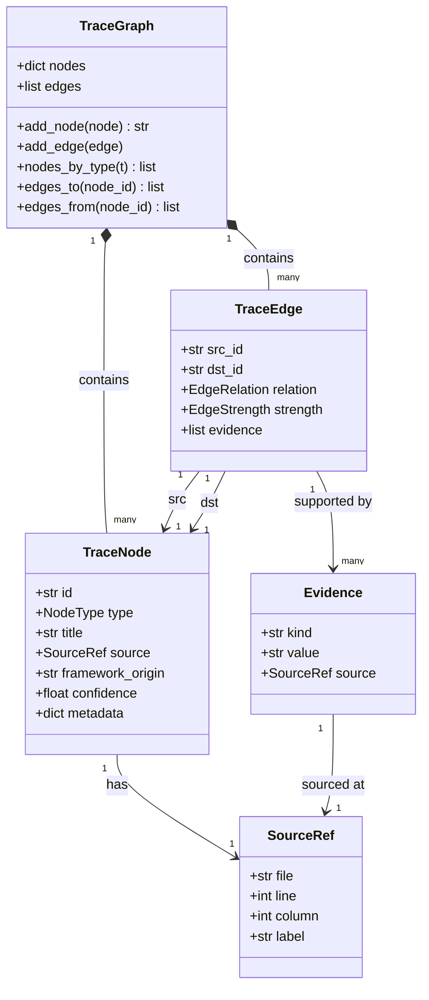

# Data Model

> **Date:** 2026-07-26
> **Version:** 0.0.1.dev0

## 1. Overview

The core data model defines three primary types that form a traceability graph:

```
TraceGraph
 ├── nodes: dict[str, TraceNode]    — all traceable elements
 └── edges: list[TraceEdge]          — relationships between nodes
```

## 2. Type Hierarchy

### 2.1 TraceNode

Represents anything that can be traced: a specification, design document, code file, test file, or task.

```python
@dataclass
class TraceNode:
    id: str                    # Stable ID (e.g. "1.1", "auth-login")
    type: NodeType             # SPEC, DESIGN, CODE, TEST, TASK
    title: str                 # Human-readable name
    source: SourceRef          # Physical location
    framework_origin: str      # "spectra", "heuristic", "cc-sdd", etc.
    confidence: float = 1.0    # 0.0–1.0
    metadata: dict = {}        # Extensible key-value store
```

**NodeType enum:**

| Value | Description | Used By |
|-------|-------------|---------|
| `SPEC` | Specification document (markdown heading) | HeuristicAdapter, SpectraAdapter |
| `DESIGN` | Design document or annotation | SpectraAdapter (`@design`, `@satisfies`) |
| `CODE` | Source code file | All adapters |
| `TEST` | Test file | HeuristicAdapter (filename patterns), SpectraAdapter (`@verifies`) |
| `TASK` | Task or issue (not yet implemented) | Reserved for future use |

**ID conventions:**

| Adapter | Format | Example |
|---------|--------|---------|
| Heuristic | `{file_stem}.{hierarchical_number}` | `auth.1.2` |
| Spectra (mapping) | From `trace-mapping.yaml` `id` field | `AUTH-1` |
| Spectra (inline) | `spec::{value}` | `spec::AUTH-1` |
| Code nodes | `{file_path}` | `src/auth/login.py` |
| Code (mapping) | `{spec_id}::{file_path}` | `AUTH-1::src/auth/login.py` |

### 2.2 TraceEdge

A directed relationship between two trace nodes.

```python
@dataclass
class TraceEdge:
    src_id: str                # Source node ID
    dst_id: str                # Destination node ID
    relation: EdgeRelation     # Type of relationship
    strength: EdgeStrength     # Confidence level
    evidence: list[Evidence]   # Justification for this edge
```

**EdgeRelation enum:**

| Value | Direction | Meaning |
|-------|-----------|---------|
| `IMPLEMENTS` | code → spec | A code file implements a specification |
| `VERIFIES` | test → spec | A test verifies a specification |
| `SATISFIES` | design → spec | A design satisfies a specification |
| `DEPENDS` | code → code | One code file depends on another (from imports) |
| `REFERENCES` | any → any | Catch-all for non-specific references |

**EdgeStrength enum:**

| Value | Meaning | Typical Source |
|-------|---------|----------------|
| `EXPLICIT` | Directly declared by user | Tag annotations (`@impl`, `@verifies`), mapping files |
| `INFERRED` | Derived with reasonable confidence | Heuristic matching with score ≥ 0.4 |
| `WEAK` | Speculative relationship | Heuristic matching with score < 0.4 |

### 2.3 Supporting Types

**SourceRef** — points to a physical location:

```python
@dataclass
class SourceRef:
    file: str                 # Relative path from project root
    line: int | None = None   # 1-indexed line number
    column: int | None = None # 0-indexed column
    label: str | None = None  # e.g. heading name, function name
```

**Evidence** — justifies why a trace edge exists:

```python
@dataclass
class Evidence:
    kind: str                 # e.g. "tag:impl", "heuristic:filename", "ast:call"
    value: str                # The extracted value (e.g. "1.1", "login")
    source: SourceRef         # Where this evidence was found
```

**Evidence kind taxonomy:**

| Kind | Meaning | Strength Level |
|------|---------|----------------|
| `tag:impl` | Explicit `@impl` annotation | EXPLICIT |
| `tag:verifies` | Explicit `@verifies` annotation | EXPLICIT |
| `tag:spec` | Explicit `<!-- @spec -->` annotation | EXPLICIT |
| `tag:satisfies` | Explicit `<!-- @satisfies -->` annotation | EXPLICIT |
| `mapping` | Explicity from `.spectra/trace-mapping.yaml` | EXPLICIT |
| `heuristic:dirname` | Directory name match | INFERRED / WEAK |
| `heuristic:filename` | File name (stem) match | INFERRED / WEAK |
| `heuristic:symbol` | Symbol vs heading keyword overlap | INFERRED / WEAK |
| `heuristic:keyword` | Heading vs file stem keyword overlap | INFERRED / WEAK |
| `import_graph` | Code dependency from imports | INFERRED |

### 2.4 TraceGraph

The top-level container for analysis results.

```python
@dataclass
class TraceGraph:
    nodes: dict[str, TraceNode] = field(default_factory=dict)
    edges: list[TraceEdge] = field(default_factory=list)
```

**Methods:**

| Method | Signature | Description |
|--------|-----------|-------------|
| `add_node` | `(node: TraceNode) -> str` | Add a node, returns its ID |
| `add_edge` | `(edge: TraceEdge) -> None` | Append an edge |
| `nodes_by_type` | `(t: NodeType) -> list[TraceNode]` | Filter nodes by type |
| `edges_to` | `(node_id: str) -> list[TraceEdge]` | All edges targeting this node (incoming) |
| `edges_from` | `(node_id: str) -> list[TraceEdge]` | All edges originating from this node (outgoing) |

**Utility function:**

| Function | Signature | Description |
|----------|-----------|-------------|
| `find_spec_nodes` | `(graph: TraceGraph, query: str) -> list[TraceNode]` | Finds spec nodes by fuzzy search (exact ID → `spec::` prefix → ID suffix → title → heading text) |

## 3. Discovery Candidates (Intermediate Types)

These are intermediate representations used by the discovery pipeline before being converted to TraceNodes.

### 3.1 SpecCandidate

```python
@dataclass
class SpecCandidate:
    file: str
    heading_depth: int          # 1-6
    heading_text: str           # Raw heading text
    auto_id: str                # Generated ID (e.g. "auth.1.2")
    title: str                  # Cleaned title
    line: int                   # 1-indexed
    body_text: str              # Full section text (heading + body)
    body_hash: str              # SHA256[:16] of body_text
    body_hash_content: str      # SHA256[:16] of body without heading line
    body_line_count: int        # Lines in body (excluding heading)
    body_preview: str           # First 80 characters
```

**Auto-ID generation:**

```
Input:  "## 1.2 Login" in docs/auth/auth.md
Output: auto_id = "auth.auth.1.2"
         title   = "Login"

Algorithm:
  1. Prefix = parent_dir.file_stem (e.g. "auth.auth")
  2. Hierarchical number from heading depth stack (e.g. "1.2")
  3. For non-numbered headings: slugify the heading text
```

### 3.2 CodeCandidate

```python
@dataclass
class CodeCandidate:
    file: str                   # Relative path from project root
    module: str                 # Parent directory name
    symbols: list[str]          # Function/class/struct names
    is_test: bool               # Detected from filename patterns
    language: str               # Human-readable language name
    imports: list[str]          # First 8 import paths
    line_count: int
    functions: list[FuncBlock]  # Per-function body hashes
    file_hash: str              # SHA256[:16] of full file
```

### 3.3 FuncBlock

```python
@dataclass
class FuncBlock:
    name: str                   # Function / class / method name
    kind: str                   # "function", "class", "method"
    line: int                   # 1-indexed start line
    body_hash: str              # SHA256[:16] of function body text
    body_lines: int
    body_preview: str           # First 80 characters
```

### 3.4 Tag (from `core/extract.py`)

```python
@dataclass
class Tag:
    kind: str                   # "impl", "module", "feature", "verifies", "spec",
                                # "design", "satisfies", "boundary"
    value: str                  # Parsed value(s)
    file: str                   # Relative path
    line: int                   # 1-indexed
    col: int = 0
```

## 4. Drift Detection Types

### 4.1 DriftReport

```python
class DriftReport:
    specs_added: list[dict]
    specs_removed: list[dict]
    specs_changed: list[dict]        # title changed
    specs_body_changed: list[dict]   # body changed, title same
    specs_renamed: list[dict]        # removed + added with same body_hash_content
    code_added: list[dict]
    code_removed: list[dict]
    code_symbols_changed: list[dict]
    code_funcs_changed: list[dict]   # function body hash changed
    new_orphan_specs: list[str]
    resolved_orphan_specs: list[str]
    new_orphan_code: list[str]
    resolved_orphan_code: list[str]
    coverage_before: dict | None
    coverage_after: dict | None

    @property
    def has_drift(self) -> bool: ...

    def render_text(self) -> str: ...

    def to_dict(self) -> dict: ...
```

## 5. Configuration Types

### 5.1 SpecbridgeConfig

```python
@dataclass
class SpecbridgeConfig:
    spec_dirs: list[str]        # Default: ["docs", "spec", "specs"]
    source_dirs: list[str]      # Default: ["src", "lib", "app"]
    exclude_dirs: set[str]      # Default: [".git", "node_modules", ".venv", ...]
    min_confidence: float       # Default: 0.15
    max_output_nodes: int       # Default: 20 (--top truncation)

    @classmethod
    def load(cls, project_dir: str | Path) -> SpecbridgeConfig: ...
```

## 6. Relationship Diagram



## 7. Serialization

The data model is serialized to JSON via dataclass introspection:

```python
def render_json(graph: TraceGraph) -> str:
    payload = {
        "specbridge_version": "0.0.1.dev0",
        "nodes": [_node_dict(n) for n in graph.nodes.values()],
        "edges": [_edge_dict(e) for e in graph.edges],
    }
    return json.dumps(payload, ...)
```

Where `_node_dict` and `_edge_dict` convert enum values to strings using `.value`.
