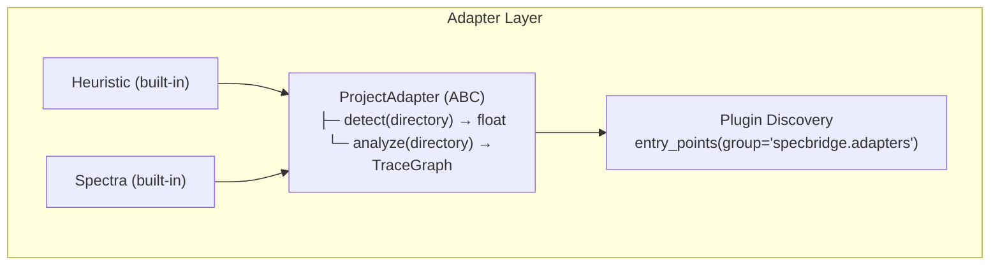
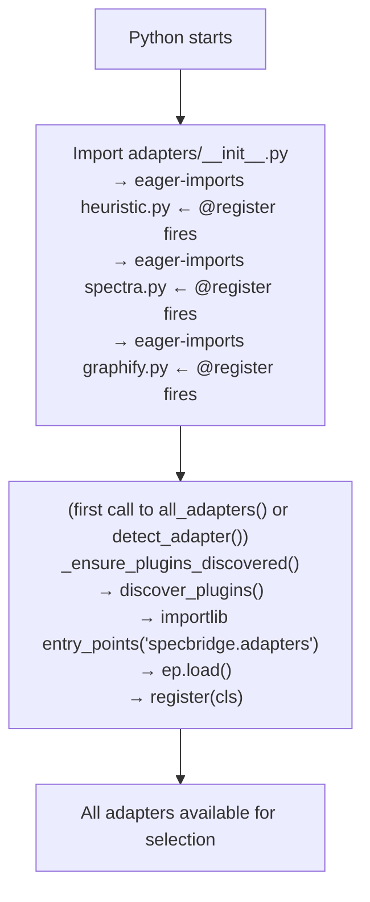

# Adapter & Plugin System

> **Date:** 2026-07-26
> **Version:** 0.0.1.dev0

## 1. Overview

specbridge uses the **Adapter pattern** to support multiple SSD (Spec-Driven Development) frameworks. Each adapter knows how to detect and analyze a specific framework's project structure. The system is extensible via Python entry points — third-party packages can register their own adapters without modifying specbridge itself.



## 2. Abstract Base: `ProjectAdapter`

All adapters inherit from `ProjectAdapter` in `adapters/_base.py`:

```python
class ProjectAdapter(ABC):

    @abstractmethod
    def detect(self, directory: str) -> float:
        """Return confidence score (0.0–1.0) that this adapter handles *directory*.
        Adapters are tried in descending confidence order; the first with >0 is used.
        Must be fast — runs on every analyze/impact/coverage call."""

    @abstractmethod
    def analyze(self, directory: str) -> TraceGraph:
        """Full project analysis. Returns a TraceGraph with all nodes and edges."""
```

### Contract

- **`detect()` must be fast** — It runs on every CLI invocation. Avoid file system traversal more than a few stats + one small file read.
- **`analyze()` must be resilient** — Handle parse errors gracefully. Return a valid `TraceGraph` (possibly empty) rather than crashing.
- **The tool is read-only** — Never write to spec or source directories. All output goes through `guard.py` → `.specbridge/`.
- **Return scores 0.0–1.0** — 0.0 means "I don't handle this project". Higher scores win.

## 3. Built-in Adapters

### 3.1 HeuristicAdapter (Primary)

**File:** `adapters/heuristic.py`

The default adapter that works on **any** project with markdown specs and source code. No tags or annotations required.

```python
@register
class HeuristicAdapter(ProjectAdapter):
    detect():
        # Returns:
        #   0.8 if project has both docs/ (or spec/) AND src/ (or lib/ or app/)
        #   0.4 if only docs/ or only src/
        #   0.0 otherwise

    analyze():
        # Delegates to infer/build_heuristic_graph():
        #   1. discover_specs() → parse markdown headings → SpecCandidate[]
        #   2. discover_code() → scan source dirs → CodeCandidate[]
        #   3. Match spec ↔ code using 4 heuristic signals (dirname, filename, symbol, keyword)
        #   4. Return TraceGraph
```

**Design rationale:** HeuristicAdapter is intentionally simple and broadly applicable. It is the **primary** adapter, loaded first. Tag-based adapters are optional extras that layer on top.

### 3.2 SpectraAdapter

**File:** `adapters/spectra.py`

Handles projects using the [spectra](https://github.com/nekolife1984/spectra) framework.

```python
@register
class SpectraAdapter(ProjectAdapter):
    detect():
        # Returns:
        #   0.95 if .spectra/trace-mapping.yaml exists
        #   0.70 if @impl tags are detected in source files
        #   0.50 if .spectra/ directory exists without mapping
        #   0.00 otherwise

    analyze():
        # 1. Load .spectra/trace-mapping.yaml → spec + code nodes + mapping edges
        # 2. Scan source files for @impl, @verifies tags
        # 3. Scan markdown files for <!-- @spec -->, <!-- @satisfies -->, _Boundary:_
        # 4. Return merged TraceGraph
```

**Tag syntax supported:**

| Tag | Location | Purpose |
|-----|----------|---------|
| `# @impl 1.1` / `// @impl 1.1` | Source code | Links code to spec |
| `# @verifies 1.1` / `// @verifies 1.1` | Test code | Links test to spec |
| `<!-- @spec 1 -->` | Markdown spec | Declares a spec section |
| `<!-- @satisfies AUTH-1 -->` | Markdown design | Design → spec edge |
| `_Boundary:_ src/path/` | Markdown spec | Declares allowed implementation paths |

### 3.3 GraphifyAdapter

**File:** `adapters/graphify.py`

**Requires:** `graphify` CLI installed (`pipx install graphifyy`). The adapter shells out to `graphify extract . --code-only` to build a deep AST-based code graph using tree-sitter (15+ languages).

```python
@register
class GraphifyAdapter(ProjectAdapter):
    detect():
        # Returns:
        #   0.90 if graphify-out/graph.json already exists (fast path)
        #   0.70 if graphify is installed but needs to run
        #   0.00 otherwise

    analyze():
        # 1. Run `graphify extract . --code-only` (or use existing cache)
        # 2. Parse graphify-out/graph.json → 790+ nodes, 1,700+ edges
        # 3. Convert all graphify nodes (functions, classes, files) → TraceNode[]
        # 4. Convert all relations (calls, imports, extends) → TraceEdge[]
        # 5. Discover specs via specbridge's `discover_specs()`
        # 6. Cross-reference spec tokens with graphify code nodes
        # 7. Return merged TraceGraph
```

**Key differences from HeuristicAdapter:**

| Aspect | HeuristicAdapter | GraphifyAdapter |
|--------|-----------------|-----------------|
| **Parser** | Regex-based symbol extraction | tree-sitter AST (deterministic, 15+ languages) |
| **Edge precision** | 4 heuristic signals (names/keywords) | Full call-graph + import-graph from AST |
| **Function-level** | Via heuristic `_score_func_edge()` | Native tree-sitter function/class nodes |
| **Code refs** | ~400 (file-level) | ~1,200+ (function-level including examples) |
| **Output size** | ~950 nodes, ~38k edges | +790 nodes, +1,700 edges from AST alone |
| **Dependency** | None (pure Python) | Requires `graphify` CLI on PATH |

**Design rationale:** GraphifyAdapter complements HeuristicAdapter by providing more precise, structure-aware code parsing. It does **not** replace heuristic matching — it runs alongside it in `--merge` mode. The adapter name "graphify" refers to the graphify tool's graph-building capability, not a requirement for graphify's LLM semantic extraction.

## 4. Adapter Registration

### 4.1 `@register` Decorator

Built-in adapters use the `@register` decorator:

```python
from specbridge.adapters._base import register, ProjectAdapter

@register
class MyAdapter(ProjectAdapter):
    ...
```

The decorator is **idempotent** — registering the same class twice is a no-op.

### 4.2 Entry Point Registration (Plugin SDK)

Third-party packages register adapters via `pyproject.toml`:

```toml
[project.entry-points."specbridge.adapters"]
my_adapter = "my_package.my_adapter:MyAdapter"
```

The plugin class must subclass `ProjectAdapter`. It does **not** need the `@register` decorator — the entry-point loader calls `register()` automatically.

Plugin discovery is **lazy** — it runs once on first access to `all_adapters()` or `detect_adapter()`.

## 5. Adapter Selection

### 5.1 Single Adapter (Default)

```python
def detect_adapter(directory: str) -> ProjectAdapter | None:
    """Try every registered adapter, return the best match."""
    for cls in _ADAPTERS:
        inst = cls()
        score = inst.detect(directory)
        if score > 0:
            scored.append((score, inst))
    scored.sort(key=lambda x: -x[0])
    return scored[0][1] if scored else None
```

Called by: `analyze`, `impact`, `coverage`, `validate-boundary`, `drift --git-base`.

### 5.2 Merge Mode

```python
def detect_all(directory: str) -> list[tuple[float, ProjectAdapter]]:
    """Return ALL adapters with positive scores, sorted descending."""

def merge_graphs(graphs: list[TraceGraph]) -> TraceGraph:
    """Union of nodes + concatenation of edges.
    Later adapters' nodes overwrite same-ID nodes from earlier ones."""
```

Called by: `analyze --merge`, `watch`, MCP server.

**Merge semantics:**
- Nodes: union by ID (later overwrites earlier)
- Edges: all edges from all graphs are appended
- No deduplication — edges with the same source/destination/relation may appear multiple times

## 6. Plugin Discovery Lifecycle



## 7. Creating a Plugin (Step-by-Step)

1. **Create a Python package** with `pyproject.toml`
2. **Subclass `ProjectAdapter`** — implement `detect()` and `analyze()`
3. **Declare the entry point** in `pyproject.toml`:
   ```toml
   [project.entry-points."specbridge.adapters"]
   my_adapter = "my_package.my_adapter:MyAdapter"
   ```
4. **Install** the package in the same Python environment as specbridge
5. **Verify** it's loaded: `specbridge plugins` → see your adapter listed

### Plugin Best Practices

- Keep `detect()` **fast** — it runs on every call
- Handle parse errors gracefully — return empty `TraceGraph()` rather than crashing
- Use the entry point mechanism (not `@register`) for distributable packages
- See `examples/example-plugin/` for a complete working example

## 8. Adapter Comparison

| Feature | HeuristicAdapter | SpectraAdapter | GraphifyAdapter |
|---------|-----------------|----------------|-----------------|
| **Detection** | Has docs/ + src/ dirs | Has `.spectra/trace-mapping.yaml` or `@impl` tags | Has `graphify` CLI on PATH |
| **Tag required** | No | Yes (optional — mapping file may be enough) | No |
| **Confidence** | 0.4–0.8 | 0.5–0.95 | 0.7–0.9 |
| **Language support** | 18 languages | 18 languages (tag extractor) | 15+ languages (tree-sitter AST) |
| **Edge sources** | Heuristic (4 signals) | Explicit tags + mapping file | Full AST call/import graph |
| **Boundary validation** | No | Yes (via `_Boundary:_` markers) | No |
| **Design → spec edges** | No | Yes (`@satisfies`) | No |
| **Function-level nodes** | Heuristic only | No | Yes (native tree-sitter) |
| **Use case** | Any project with docs + code | Projects using spectra framework | Projects where `graphify` is installed |
