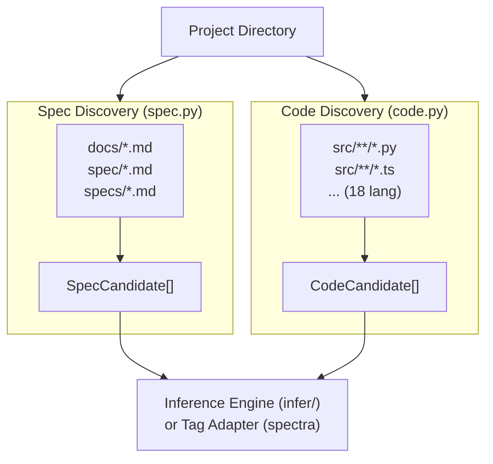

# Discovery Engine

> **Date:** 2026-07-26
> **Version:** 0.0.1.dev0

## 1. Overview

The discovery layer is responsible for scanning a project directory and extracting **candidates** for both specification documents and source code files. These candidates are then consumed by the inference engine (for heuristic matching) or directly by tag-based adapters.



## 2. Spec Discovery (`discovery/spec.py`)

### 2.1 What It Does

Scans Markdown files (`.md`) in designated spec directories (`docs/`, `spec/`, `specs/`) and parses their heading hierarchy into `SpecCandidate` objects. Each heading becomes one spec candidate.

### 2.2 Search Paths

| Config | Default | Description |
|--------|---------|-------------|
| `spec_dirs` | `["docs", "spec", "specs"]` | Directories to scan for spec markdown files |

Excluded directories are defined in `_EXCLUDE_DIRS` and include `.git`, `node_modules`, `.venv`, `__pycache__`, `dist`, `build`, `.spectra`, `.specbridge`, `.artgraph`, `.trace`, and others.

Excluded files include `README.md`, `CHANGELOG.md`, `CONTRIBUTING.md`, `LICENSE.md`, `index.md`, `_sidebar.md`, `_navbar.md`.

### 2.3 Section Splitting Algorithm

```python
def _split_sections(text: str) -> list[dict]:
    """Split markdown into sections by heading lines.
    Returns: [{line, depth, raw heading text, body text}]"""
```

The algorithm iterates through all lines, detecting headings via `#{1,6} heading` pattern. Each section's body is the text between this heading and the next heading at any depth (or EOF).

### 2.4 Auto-ID Generation

Spec candidates are assigned auto-generated stable IDs based on:

1. **File-based prefix**: `{parent_dir}.{file_stem}.`
   - Example: `docs/auth/auth.md` → prefix = `auth.auth.`

2. **Hierarchical number**: From heading depth stack
   - `# Section` → `1`
   - `## Subsection` → `1.1`
   - `### Detail` → `1.1.1`
   - `## Another` → `1.2`

3. **Final auto_id**: `{prefix}{hierarchical_number}`
   - Example: `auth.auth.1.2`

4. **For non-numbered headings**: The heading text is slugified into an alphanumeric ID fragment
   - `## User Login` → slug = `user-login`

### 2.5 Body Hashing for Drift Detection

Each spec section body is hashed with SHA256 (first 16 hex chars) for drift comparison:

- **`body_hash`**: SHA256 of the full section body (heading line + body text)
- **`body_hash_content`**: SHA256 of the body text **excluding** the heading line (used for rename detection)

### 2.6 SpecCandidate Output

```python
@dataclass
class SpecCandidate:
    file: str               # Relative path e.g. "docs/auth/auth.md"
    heading_depth: int      # 1–6
    heading_text: str       # Raw heading text e.g. "## 1.2 Login"
    auto_id: str            # e.g. "auth.auth.1.2"
    title: str              # Cleaned e.g. "Login"
    line: int               # 1-indexed
    parent_chain: list[str] | None  # e.g. ["Data Model", "Type Hierarchy"]
    body_text: str          # Full section text
    body_hash: str          # SHA256[:16]
    body_hash_content: str  # SHA256[:16] without heading
    body_line_count: int    # Lines after heading
    body_preview: str       # First 80 chars
```

## 3. Code Discovery (`discovery/code.py`)

### 3.1 What It Does

Scans source code directories (`src/`, `lib/`, `app/`) for files across 18 programming languages. Extracts symbols (functions, classes), imports, and creates function-level body hashes.

### 3.2 Supported Languages (18)

| Extension | Language | Comment Style |
|-----------|----------|---------------|
| `.py` | Python | `#` |
| `.rb` | Ruby | `#` |
| `.sh`, `.bash`, `.zsh` | Shell | `#` |
| `.ts`, `.tsx` | TypeScript/TSX | `//` |
| `.js`, `.jsx` | JavaScript/JSX | `//` |
| `.go` | Go | `//` |
| `.rs` | Rust | `//` |
| `.cpp`, `.hpp` | C++ | `//` |
| `.c`, `.h` | C | `//` |
| `.cs` | C# | `//` |
| `.java` | Java | `//` |
| `.kt` | Kotlin | `//` |
| `.swift` | Swift | `//` |
| `.scala` | Scala | `//` |
| `.dart` | Dart | `//` |
| `.php`, `.phtml` | PHP | `//` |

### 3.3 Symbol Extraction

Uses a multi-language regex pattern for function/class/struct definitions:

```python
_RE_FUNC_DEF = re.compile(
    r"^"
    r"(?:"
    r"(?:\s*(?:public|private|protected|static|async|export|pub|override"
    r"|abstract|virtual|sealed|internal|open)\s+)*"
    r"(?:def|function|fn|class|trait|interface|struct|enum|impl"
    r"|mixin|extension|typedef|record)"
    r"\s+([A-Za-z_]\w*)"
    r")"
    r".*?(?:\(|: |:|=>|=|{)",        # note: `(` supports multi-line sigs
    re.MULTILINE,
)
```

This regex handles:
- **Python**: `def login():`, `class User:`, `def build_graph(` (multi-line param)
- **TypeScript**: `function login()`, `class User {`
- **Go**: `func Login()`, `type User struct {`
- **Rust**: `fn login()`, `struct User`
- **Java**: `public class User`, `void login()`
- And many more.

The `(` terminator was added to capture multi-line function signatures like `def build_heuristic_graph(\n    project_dir: str, ...` where the `def` line doesn't contain `:`, `=>`, `=`, or `{`.

### 3.4 Import Extraction

Language-specific regexes extract up to 8 import paths per file:

- **Python**: `import X`, `from X import Y`
- **TypeScript/JavaScript**: `import X from 'Y'`, `require('Y')`
- **Rust**: `use X::Y`

### 3.5 Function Body Hashing

Each function/class definition is extracted as a `FuncBlock` with its own body hash:

```python
def _extract_func_blocks(text, lines):
    """Find all function/class definitions, extract their body text,
    and compute SHA256[:16] hash for each."""
```

Function bodies span from their definition line to the line before the next definition (or EOF). This enables **per-function drift detection**.

### 3.6 Test File Detection

Files are marked as tests based on filename patterns:
- `test_*`, `*_test`, `*.test.*`, `*.spec.*`, `*Test*`, `*_spec.*`

### 3.7 CodeCandidate Output

```python
@dataclass
class CodeCandidate:
    file: str               # Relative path e.g. "src/auth/login.py"
    module: str             # Parent directory name e.g. "auth"
    symbols: list[str]      # Extracted symbols e.g. ["login", "User"]
    is_test: bool           # True if filename matches test patterns
    language: str           # "Python", "TypeScript", etc.
    imports: list[str]      # Up to 8 import paths
    line_count: int         # Total lines
    functions: list[FuncBlock]  # Per-function body hashes
    file_hash: str          # SHA256[:16] of entire file
```

### 3.8 Exclusion Rules

Directories excluded from scanning: `.git`, `node_modules`, `.venv`, `__pycache__`, `dist`, `build`, `.spectra`, `.specbridge`, `.artgraph`, `.trace`, `venv`, `env`, `.tox`, `.mypy_cache`, `.ruff_cache`, `.pytest_cache`, `.egg-info`, `site-packages`, `coverage`, `htmlcov`

## 4. AST-Based Enhancement (`discovery/ast.py`)

An optional enhancement using **tree-sitter** for more accurate multi-language function extraction:

```bash
# Install tree-sitter with language grammars
pip install specbridge[ast]
```

| Language | Grammar Package | Node Types Extracted |
|----------|----------------|---------------------|
| **Python** | `tree-sitter-python` | `function_definition`, `class_definition`, decorated definitions |
| **TypeScript/JavaScript** | `tree-sitter-typescript` | `function_declaration`, `class_declaration`, `method_definition`, `arrow_function` (via `lexical_declaration`), `generator_function_declaration` |
| **TSX/JSX** | `tree-sitter-typescript` (`language_tsx`) | Same as TypeScript, plus JSX syntax |
| **Go** | `tree-sitter-go` | `function_declaration`, `method_declaration` |
| **Rust** | `tree-sitter-rust` | `function_item`, `struct_item`, `enum_item`, `trait_item`, `impl_item`, `type_item`, `const_item` |

### When to Use

- **tree-sitter is available** (recommended): Handles nested functions, decorators, complex syntax correctly — more accurate than regex
- **tree-sitter unavailable** (fallback): Falls back to the regex-based `_extract_func_blocks()` from `code.py`

### Architecture

All language parsers follow the same pattern, dispatched automatically by file extension via `extract_functions()`:

```
extract_functions(file_path)
    │
    ├── .py    → extract_functions_python()
    ├── .ts/.tsx/.js/.jsx/.mjs/.cjs  → extract_functions_typescript()
    ├── .go    → extract_functions_go()
    ├── .rs    → extract_functions_rust()
    └── other  → fall back to regex _extract_func_blocks()

Each language parser:
    │
    ├──▶ Tree-sitter available?
    │       YES → Parse with language grammar
    │              → Walk AST for function/class/struct/enum definitions
    │              → Extract body text + SHA256[:16] hash
    │
    └──▶ NO → Fall back to _extract_functions_regex_fallback()
                 → Uses code.py's multi-language regex approach
```

**Depth limit**: AST traversal is capped at 200 levels to prevent infinite recursion on pathological inputs.

### Name Resolution

Each language grammar uses different node types for identifiers:

| Language | Function Name Node | Class Name Node | Method Name Node |
|----------|-------------------|----------------|-----------------|
| Python | `name` (field) | `name` (field) | `name` (field) |
| TypeScript | `identifier` | `type_identifier` | `property_identifier` |
| Go | `identifier` | — | `field_identifier` |
| Rust | `identifier` | `type_identifier` | `type_identifier` (in `impl_item`) |

The `_find_child_by_types()` helper tries candidate node types in order, making the walker grammar-agnostic.

## 5. Tag Extraction (`core/extract.py`)

While not strictly part of the discovery pipeline, the tag extractor is closely related. It scans both source and spec files for annotation tags.

### Extraction Strategies

| File Type | Method | Why |
|-----------|--------|-----|
| Python (`.py`) | `tokenize` | Avoids matching tags inside string literals (f-strings, docstrings) |
| All other source | Regex | Fast, no false positives from tokenizer |
| Markdown (`.md`, `.mdx`, `.rst`) | HTML comment regex | `<!-- @spec -->` style annotations |

### Extracted Tag Types

| Tag Kind | Source | Example |
|----------|--------|---------|
| `impl` | Source code (`#`, `//`) | `# @impl 1.1` |
| `module` | Source code (`#`, `//`) | `# @module auth` |
| `feature` | Source code (`#`, `//`) | `# @feature login` |
| `verifies` | Test code (`#`, `//`) | `# @verifies 1.1` |
| `spec` | Markdown (`<!-- -->`) | `<!-- @spec 1 -->` |
| `design` | Markdown (`<!-- -->`) | `<!-- @design AuthService -->` |
| `satisfies` | Markdown (`<!-- -->`) | `<!-- @satisfies AUTH-1 -->` |
| `boundary` | Markdown (line start) | `_Boundary:_ src/path/` |
