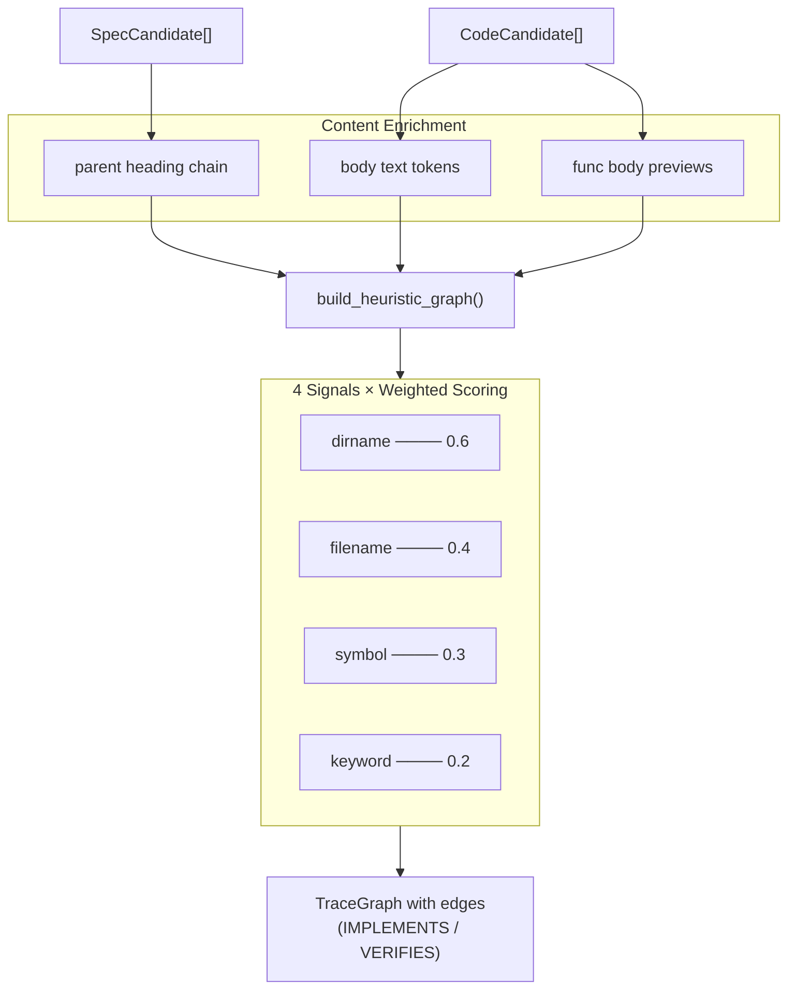

# Heuristic Matching Engine

> **Date:** 2026-07-26
> **Version:** 0.0.1.dev0

## 1. Overview

The heuristic matching engine (`infer/__init__.py`) is the core of the **no-tag-first** approach. It builds a `TraceGraph` by discovering specs and code candidates, then inferring relationships between them using four structural signals — with **no tags or annotations required**.



**Key improvements over basic heading matching:**

| Enrichment | Source | Effect |
|-----------|--------|--------|
| **Parent heading chain** | Spec heading hierarchy | Deep sections inherit broader context (e.g. "TraceNode" also gets "Data Model" + "Type Hierarchy") |
| **Body text tokens** | Spec section body (first 300 chars) | Captures class/function names mentioned in prose |
| **Function body previews** | Code function docstrings | Matches spec prose that describes code behavior |
| **`__init__.py` → parent dir** | Code file path | `core/__init__.py` is matched as `core`, not `__init__` |
| **Subset bonus** | Symbol × heading overlap | `spec_tokens ⊆ code_keywords` → boosts Jaccard score to ≥0.85 |

## 2. Algorithm: `build_heuristic_graph()`

```python
def build_heuristic_graph(
    project_dir: str,
    *,
    specs: list[SpecCandidate] | None = None,
    codes: list[CodeCandidate] | None = None,
    spec_dirs: list[str] | None = None,
    source_dirs: list[str] | None = None,
) -> TraceGraph:
```

**Steps:**

### Step 1: Discover candidates

If `specs`/`codes` are not pre-provided, run:
- `discover_specs(project_dir, spec_dirs)` → `SpecCandidate[]`
- `discover_code(project_dir, source_dirs)` → `CodeCandidate[]`

This allows callers (like drift detection) to pass pre-computed candidates and avoid redundant scanning.

### Step 2: Convert to TraceNodes

Each `SpecCandidate` → `TraceNode(type=SPEC, framework_origin="heuristic")`
Each `CodeCandidate` → `TraceNode(type=CODE or TEST, framework_origin="heuristic")`

### Step 3: Build enriched spec tokens

Before scoring, each spec's heading text is enriched with additional content:

```python
spec_text = f"{sc.title} {sc.heading_text}"
if sc.parent_chain:
    spec_text += " " + " ".join(sc.parent_chain)   # parent headings
if sc.body_text:
    spec_text += " " + sc.body_text[:300]            # first 300 chars of body
spec_tokens = _tokenize(spec_text)
```

This means a spec section `"TraceNode"` under `"Type Hierarchy"` under `"Data Model"` would produce tokens from: `trace node type hierarchy data model` plus body content mentioning `TraceNode`, `@dataclass`, etc.

### Step 4: Score every spec–code pair

For each `SpecCandidate` × `CodeCandidate` pair, compute a confidence score using four signals:

```
confidence = weighted_score / total_weight
```

If `confidence >= _MIN_CONFIDENCE (0.15)`, add an edge to the graph.

## 3. The Four Signals

### 3.1 Directory Name Matching (`_W_DIRNAME = 0.6`)

Compares the immediate parent directory of the spec file and the code file.

**Scoring:**
- **Exact match** (both in `auth/`): conf = 1.0 × weight
- **Partial match** (`auth/` ↔ `authentication/`): conf = 0.6 × weight
- **No match**: conf = 0.0

### 3.2 File Name Matching (`_W_FILENAME = 0.4`)

Compares the stem (filename without extension) of the spec and code files.

**Special handling for `__init__.py`:** when the code file is named `__init__.py`, the parent directory name is used as the stem instead. For example, `core/__init__.py` is matched as `core`, `analyzers/__init__.py` as `analyzers`.

**Scoring:**
- **Exact match** (`login.md` ↔ `login.py`): conf = 1.0 × weight
- **Partial match** (`login.md` ↔ `login_helper.py`): conf = 0.5 × weight
- **No match**: conf = 0.0

### 3.3 Symbol ↔ Heading Keyword Overlap (`_W_SYMBOL = 0.3`)

Compares symbols extracted from code (function/class names) against tokenized heading text from specs.

**Code-side tokens** are enriched with function body previews (first 80 chars of each function's body text), so docstrings and inline comments contribute to matching.

```python
code_text = f"{cc.file} {' '.join(cc.symbols)}"
if cc.functions:
    code_text += " " + " ".join(f.body_preview for f in cc.functions)
code_keywords = _tokenize(code_text)
```

**Scoring:**
```
overlap = spec_tokens & code_keywords
jaccard = len(overlap) / len(spec_tokens | code_keywords)
score = min(jaccard × 3, 1.0)
```
Then apply the **subset bonus**: if `spec_tokens ⊆ code_keywords` (all spec heading tokens appear in code symbols), score is boosted to at least **0.85**. This prevents large `__init__.py` files with many symbols from diluting the Jaccard across irrelevant tokens.

The ×3 multiplier boosts partial matches quickly toward 1.0.

### 3.4 Heading ↔ File Stem Keyword Overlap (`_W_KEYWORD = 0.2`)

Compares tokenized spec heading text against tokenized code file stem. For `__init__.py` files, the parent directory name is used as the stem (same rule as Signal 2).

**Scoring:** Same Jaccard-based formula as symbol matching, with ×3 boost.

### Processing Detail

```python
def _score_edge(sc, cc, spec_tokens, project_dir):
    evidence = []
    total_weight = 0.0
    weighted_score = 0.0

    # Signal 1: Directory name
    if spec_dir and code_dir and spec_dir == code_dir:
        weighted_score += 0.6 * 1.0       # exact
    elif spec_dir in code_dir or code_dir in spec_dir:
        weighted_score += 0.6 * 0.6       # partial
    total_weight += 0.6

    # Signal 2: File name (__init__.py uses parent dir)
    if spec_stem.lower() == code_stem.lower():
        weighted_score += 0.4 * 1.0       # exact
    elif spec_stem.lower() in code_stem.lower() or ...:
        weighted_score += 0.4 * 0.5       # partial
    total_weight += 0.4

    # Signal 3: Symbol overlap (enriched with func body previews)
    overlap = spec_tokens & code_keywords
    if overlap:
        jaccard = len(overlap) / len(spec_tokens | code_keywords)
        score = min(jaccard * 3, 1.0)
        if spec_tokens.issubset(code_keywords):
            score = max(score, 0.85)      # subset bonus
        weighted_score += 0.3 * score
    total_weight += 0.3

    # Signal 4: Keyword overlap
    overlap = spec_tokens & file_keywords
    if overlap:
        jaccard = len(overlap) / len(spec_tokens | file_keywords)
        weighted_score += 0.2 * min(jaccard * 3, 1.0)
    total_weight += 0.2

    if total_weight == 0:
        return 0.0, []
    confidence = weighted_score / total_weight
    return round(min(confidence, 1.0), 4), evidence
```

## 4. Tokenization

```python
def _tokenize(text: str) -> set[str]:
    """Split text into lowercase tokens, removing stopwords.

    Splits CamelCase and underscore-separated identifiers so that
    e.g. ``ProjectAdapter`` yields ``{'project', 'adapter'}``
    and ``detect_adapter`` yields ``{'detect', 'adapter'}``.
    """
    # Insert space between lowercase–uppercase transitions (CamelCase split)
    text = re.sub(r"([a-z])([A-Z])", r"\1 \2", text)
    # Split on underscores so snake_case tokens become separate words
    text = text.replace("_", " ")
    tokens = set(re.findall(r"[a-zA-Z_][a-zA-Z0-9_]{2,}", text.lower()))
    return tokens - _STOPWORDS
```

**Stopwords** (common English words that add no signal):
```
the, a, an, and, or, of, to, in, for, on, is,
are, was, be, has, have, do, does, should, will,
with, as, at, by, from, it, its, this, that
```

Only tokens ≥ 3 characters are retained. CamelCase identifiers like `ProjectAdapter` are split into `project` + `adapter` before stopword removal, dramatically improving cross-lingual matching (e.g., Japanese docs with English CamelCase terms).

## 5. Edge Classification

| Confidence Range | EdgeStrength | EdgeRelation (code) | EdgeRelation (test) |
|-----------------|--------------|---------------------|---------------------|
| ≥ 0.4 | `INFERRED` | `IMPLEMENTS` | `VERIFIES` |
| 0.15–0.39 | `WEAK` | `IMPLEMENTS` | `VERIFIES` |
| < 0.15 | (no edge) | — | — |

## 6. Design Decisions

### Why 0.15 minimum?

The minimum threshold (`_MIN_CONFIDENCE = 0.15`) is deliberately low to avoid false negatives. Users can filter with `--top N` at output time, and the edge `strength` field lets downstream tooling decide what to trust.

### Why weighted average instead of sum?

A weighted average normalizes the score to 0.0–1.0 regardless of how many signals fired. This prevents projects with only one signal type (e.g., only directory matching) from being penalized.

### Why ×3 boost on Jaccard?

Jaccard similarity on short texts (headings are usually 2–5 words, file stems 1–3 words) is naturally low. The ×3 multiplier maps typical overlaps (e.g. 2/8 tokens = 0.25) to a useful range (0.75).

### Why subset bonus?

Large `__init__.py` files export many symbols (8+), which dilutes Jaccard similarity to well below 0.15 even when the spec heading perfectly matches one of the symbols. The subset bonus (`spec_tokens ⊆ code_keywords`) detects this case and guarantees a minimum score of 0.85 for the symbol signal, raising overall confidence above threshold.

## 7. Evidence Chain

Every edge carries a list of `Evidence` objects that explain *why* the relationship was inferred:

```
Edge from "specbridge/core/__init__.py → docs.en.02-data-model.1.2.1"
  Evidence 1: kind="heuristic:symbol", value="keyword overlap: trace, node"
  Evidence 2: kind="heuristic:subset", value="all spec tokens found in code symbols"
```

Evidence kinds include:
- `heuristic:dirname` — directory name match
- `heuristic:filename` — file name match
- `heuristic:symbol` — symbol/heading keyword overlap (with optional subset bonus)
- `heuristic:keyword` — file stem keyword overlap
- `heuristic:subset` — all spec tokens covered by code symbols (bonus)

This transparency is a core principle — users always see the reasoning behind each inferred relationship.

## 8. Performance Characteristics

- **Time complexity**: O(S × C) where S = spec candidates, C = code candidates
- **No I/O during matching** (all data already discovered)
- Tokenization and Jaccard computation are CPU-light for typical project sizes (< 500 candidates each)

## 9. Input Parameters

The function accepts optional pre-computed candidates to avoid redundant re-discovery:

```python
# Used by drift detection (already has specs and codes from snapshot re-discover)
build_heuristic_graph(root, specs=curr_specs, codes=curr_codes, spec_dirs=config.spec_dirs, source_dirs=config.source_dirs)
```

## 10. Function-Level Traceability

In addition to file-level matching (section 5), `build_heuristic_graph()` now emits **function-level** nodes and edges. Each function/class definition discovered in `CodeCandidate.functions` is added as its own `TraceNode` with ID `file.py::func_name`.

### Step 6: Score functions against specs

After all file→spec edges are created, the engine runs a second pass matching each individual function against every spec section:

```python
for sc in specs:
    spec_tokens = _tokenize(f"{sc.title} ...")
    for cc in codes:
        if not cc.functions:
            continue
        for func in cc.functions:
            func_tokens = _tokenize(f"{func.name} {func.body_preview}")
            conf = _score_func_edge(sc, func, spec_tokens, func_tokens)
            if conf >= _MIN_CONFIDENCE:
                # Add function node and edge
                graph.add_node(TraceNode(id=f"{cc.file}::{func.name}", ...))
                graph.add_edge(TraceEdge(src_id=f"{cc.file}::{func.name}", dst_id=sc.auto_id, ...))
```

### Scoring: `_score_func_edge()`

Function-level scoring focuses on function name ↔ spec heading overlap, using a simplified version of the file-level formula:

```python
def _score_func_edge(sc, func, spec_tokens, func_tokens):
    overlap = spec_tokens & func_tokens
    if not overlap:
        return 0.0
    jaccard = len(overlap) / len(spec_tokens | func_tokens)
    score = jaccard * 3  # same ×3 boost
    # Perfect subset match → near-certain confidence
    if spec_tokens.issubset(func_tokens) or func_tokens.issubset(spec_tokens):
        score = max(score, 0.9)
    return round(min(score, 1.0), 4)
```

This means a function named `build_heuristic_graph()` matched against the spec heading "Algorithm: `build_heuristic_graph()`" produces tokens `{build, heuristic, graph, algorithm}` on both sides → high overlap → strong edge.

### Output

Function nodes appear in a dedicated `🔧 Function refs:` section in text output:

```
🔧 Function refs:
  specbridge/core/__init__.py::TraceNode      → docs.en.02-data-model.1.2.1
  specbridge/infer/__init__.py::_tokenize     → docs.en.05-heuristic-matching.1.4
  specbridge/adapters/_base.py::ProjectAdapter → docs.en.03-adapter-plugin-system.1.2, ...
```

In JSON output, function nodes are included in the `nodes` array alongside file-level nodes, distinguished by `::` in their ID.

### Impact on coverage

With function-level matching, a spec section becomes "covered" if **any** implementing function edge reaches it — even when the file-level match missed it. This typically raises spec coverage by 20–30 percentage points on well-documented projects.

### Why function-level matching?

File-level matching is conservative: `core/__init__.py` defines 8+ classes (`TraceNode`, `TraceEdge`, `TraceGraph`, ...) and the Jaccard similarity between any single class name and its spec heading is diluted by the other symbols. Function-level matching eliminates this dilution by scoring each function independently, creating direct edges from `core/__init__.py::TraceNode` → `docs.en.02-data-model.1.2.1`.
