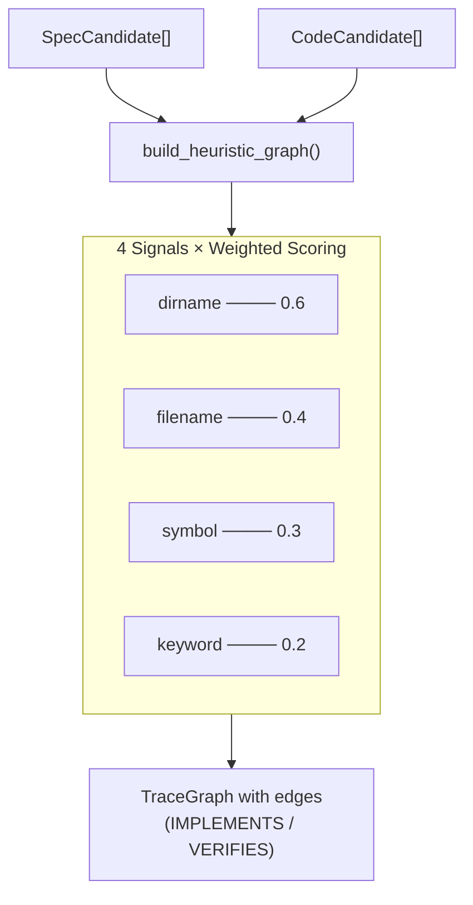

# Heuristic Matching Engine

> **Date:** 2026-07-26
> **Version:** 0.0.1.dev0

## 1. Overview

The heuristic matching engine (`infer/__init__.py`) is the core of the **no-tag-first** approach. It builds a `TraceGraph` by discovering specs and code candidates, then inferring relationships between them using four structural signals — with **no tags or annotations required**.



## 2. Algorithm: `build_heuristic_graph()`

```python
def build_heuristic_graph(
    project_dir: str,
    *,
    specs: list[SpecCandidate] | None = None,
    codes: list[CodeCandidate] | None = None,
    spec_dirs: list[str] | None = None,
    source_dirs: list[str] | None = None,
) -> TraceGraph:
```

**Steps:**

### Step 1: Discover candidates

If `specs`/`codes` are not pre-provided, run:
- `discover_specs(project_dir, spec_dirs)` → `SpecCandidate[]`
- `discover_code(project_dir, source_dirs)` → `CodeCandidate[]`

This allows callers (like drift detection) to pass pre-computed candidates and avoid redundant scanning.

### Step 2: Convert to TraceNodes

Each `SpecCandidate` → `TraceNode(type=SPEC, framework_origin="heuristic")`
Each `CodeCandidate` → `TraceNode(type=CODE or TEST, framework_origin="heuristic")`

### Step 3: Score every spec–code pair

For each `SpecCandidate` × `CodeCandidate` pair, compute a confidence score using four signals:

```
confidence = weighted_score / total_weight
```

If `confidence >= _MIN_CONFIDENCE (0.15)`, add an edge to the graph.

## 3. The Four Signals

### 3.1 Directory Name Matching (`_W_DIRNAME = 0.6`)

Compares the immediate parent directory of the spec file and the code file.

**Scoring:**
- **Exact match** (both in `auth/`): conf = 1.0 × weight
- **Partial match** (`auth/` ↔ `authentication/`): conf = 0.6 × weight
- **No match**: conf = 0.0

### 3.2 File Name Matching (`_W_FILENAME = 0.4`)

Compares the stem (filename without extension) of the spec and code files.

**Scoring:**
- **Exact match** (`login.md` ↔ `login.py`): conf = 1.0 × weight
- **Partial match** (`login.md` ↔ `login_helper.py`): conf = 0.5 × weight
- **No match**: conf = 0.0

### 3.3 Symbol ↔ Heading Keyword Overlap (`_W_SYMBOL = 0.3`)

Compares symbols extracted from code (function/class names) against tokenized heading text from specs.

**Scoring:**
```
overlap = spec_tokens & code_tokens
jaccard = len(overlap) / len(spec_tokens | code_tokens)
conf = min(jaccard × 3, 1.0) × weight
```

The ×3 multiplier boosts partial matches quickly toward 1.0.

### 3.4 Heading ↔ File Stem Keyword Overlap (`_W_KEYWORD = 0.2`)

Compares tokenized spec heading text against tokenized code file stem.

**Scoring:** Same Jaccard-based formula as symbol matching, with ×3 boost.

### Processing Detail

```python
def _score_edge(sc, cc, spec_tokens, project_dir):
    evidence = []
    total_weight = 0.0
    weighted_score = 0.0

    # Signal 1: Directory name
    if spec_dir and code_dir and spec_dir == code_dir:
        weighted_score += 0.6 * 1.0       # exact
    elif spec_dir in code_dir or code_dir in spec_dir:
        weighted_score += 0.6 * 0.6       # partial
    total_weight += 0.6

    # Signal 2: File name
    if spec_stem.lower() == code_stem.lower():
        weighted_score += 0.4 * 1.0       # exact
    elif spec_stem.lower() in code_stem.lower() or ...:
        weighted_score += 0.4 * 0.5       # partial
    total_weight += 0.4

    # Signal 3: Symbol overlap
    overlap = spec_tokens & code_keywords
    if overlap:
        jaccard = len(overlap) / len(spec_tokens | code_keywords)
        weighted_score += 0.3 * min(jaccard * 3, 1.0)
    total_weight += 0.3

    # Signal 4: Keyword overlap
    overlap = spec_tokens & file_keywords
    if overlap:
        jaccard = len(overlap) / len(spec_tokens | file_keywords)
        weighted_score += 0.2 * min(jaccard * 3, 1.0)
    total_weight += 0.2

    if total_weight == 0:
        return 0.0, []
    confidence = weighted_score / total_weight
    return round(min(confidence, 1.0), 4), evidence
```

## 4. Tokenization

```python
def _tokenize(text: str) -> set[str]:
    """Split text into lowercase tokens, removing stopwords."""
    tokens = set(re.findall(r"[a-zA-Z_][a-zA-Z0-9_]{2,}", text.lower()))
    return tokens - _STOPWORDS
```

**Stopwords** (common English words that add no signal):
```
the, a, an, and, or, of, to, in, for, on, is,
are, was, be, has, have, do, does, should, will,
with, as, at, by, from, it, its, this, that
```

Only tokens ≥ 3 characters are retained.

## 5. Edge Classification

| Confidence Range | EdgeStrength | EdgeRelation (code) | EdgeRelation (test) |
|-----------------|--------------|---------------------|---------------------|
| ≥ 0.4 | `INFERRED` | `IMPLEMENTS` | `VERIFIES` |
| 0.15–0.39 | `WEAK` | `IMPLEMENTS` | `VERIFIES` |
| < 0.15 | (no edge) | — | — |

## 6. Design Decisions

### Why 0.15 minimum?

The minimum threshold (`_MIN_CONFIDENCE = 0.15`) is deliberately low to avoid false negatives. Users can filter with `--top N` at output time, and the edge `strength` field lets downstream tooling decide what to trust.

### Why weighted average instead of sum?

A weighted average normalizes the score to 0.0–1.0 regardless of how many signals fired. This prevents projects with only one signal type (e.g., only directory matching) from being penalized.

### Why ×3 boost on Jaccard?

Jaccard similarity on short texts (headings are usually 2–5 words, file stems 1–3 words) is naturally low. The ×3 multiplier maps typical overlaps (e.g. 2/8 tokens = 0.25) to a useful range (0.75).

## 7. Evidence Chain

Every edge carries a list of `Evidence` objects that explain *why* the relationship was inferred:

```
Edge from "src/auth/login.py" → "auth.auth.1.2"
  Evidence 1: kind="heuristic:dirname", value="dir 'auth' matches"   [from spec file]
  Evidence 2: kind="heuristic:filename", value="basename 'auth' ≈ 'login' (partial)" [from spec file]
  Evidence 3: kind="heuristic:keyword", value="keyword overlap: login" [from spec file]
```

This transparency is a core principle — users always see the reasoning behind each inferred relationship.

## 8. Performance Characteristics

- **Time complexity**: O(S × C) where S = spec candidates, C = code candidates
- **No I/O during matching** (all data already discovered)
- Tokenization and Jaccard computation are CPU-light for typical project sizes (< 500 candidates each)

## 9. Input Parameters

The function accepts optional pre-computed candidates to avoid redundant re-discovery:

```python
# Used by drift detection (already has specs and codes from snapshot re-discover)
build_heuristic_graph(root, specs=curr_specs, codes=curr_codes, spec_dirs=config.spec_dirs, source_dirs=config.source_dirs)
```
