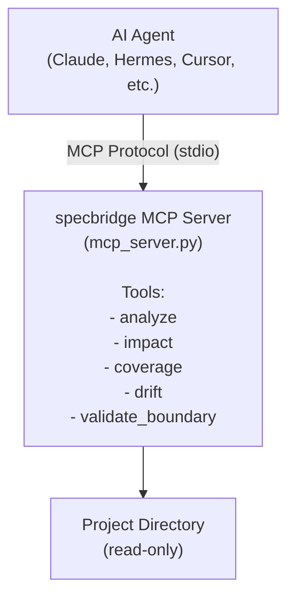
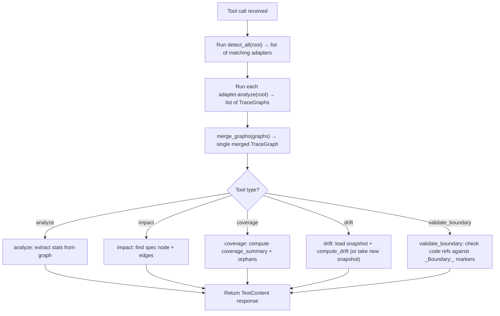

# MCP Integration

> **Date:** 2026-07-26
> **Version:** 0.0.1.dev0

## 1. Overview

specbridge provides an MCP (Model Context Protocol) server that exposes its analysis capabilities as tools for AI agents. This enables integration with IDEs, chat interfaces, and automated workflows that support the MCP protocol.



## 2. Architecture

### 2.1 Server Initialization

```python
def create_mcp_server(project_dir: str = ".") -> object:
    """Create an MCP server instance with specbridge tools."""
    from mcp.server import Server
    root = Path(project_dir).resolve()
    server = Server("specbridge")
    # ... tool registration ...
    return server
```

### 2.2 Transport

The server uses **stdio transport** — it communicates with the AI agent via stdin/stdout:

```python
async def run_mcp_server(project_dir: str = ".") -> None:
    from mcp.server.stdio import stdio_server
    server = create_mcp_server(project_dir)
    async with stdio_server() as (read_stream, write_stream):
        await server.run(read_stream, write_stream, server.create_initialization_options())
```

### 2.3 Dependency

The MCP server requires the `mcp` Python package (optional dependency):

```
pip install specbridge[mcp]
```

## 3. Exposed Tools

### 3.1 `analyze`

Run full spec-code trace analysis on the project.

- **No input parameters**
- **Returns**: Summary text with node counts and coverage percentage
- **Use case**: Agent wants a quick overview of traceability health

### 3.2 `impact`

Find what implements a given spec. Supports **fuzzy spec resolution** — you can search by ID suffix, title, or heading text. Also supports **transitive (indirect) impact** via call graph analysis (v1.0).

- **Required parameter**: `spec_id` — e.g. `"1.1"`, `"TraceNode"`, `"build_heuristic_graph"`
- **Optional parameters**:
  - `call_graph` (boolean, default: false) — include transitive (indirect) impact via function-level call graph
  - `max_depth` (integer, default: 3) — max call-graph traversal depth
- **Resolution order**: exact ID → `spec::` prefix → ID suffix match → title substring → heading text
- **Multiple matches**: when more than one spec matches, all are returned with their implementing artifacts
- **Returns**: List of implementing code/test files with confidence and evidence, including function-level and transitive edges
- **Use case**: Agent asks "what implements spec TraceNode?" or "what files are indirectly impacted by spec 1.1?"

### 3.3 `coverage`

Get spec coverage statistics.

- **No input parameters**
- **Returns**: Coverage percentage, orphan specs and code files (up to 5)
- **Use case**: Agent checks spec coverage before/after a change

### 3.4 `drift`

Detect changes between snapshot and current state.

- **Optional parameter**: `take_snapshot` (boolean, default: false)
  - `true`: Takes a new snapshot (no comparison)
  - `false`: Compares current state against the last snapshot
- **Returns**: Drift report text
- **Use case**: Agent checks "has anything drifted since last snapshot?"

### 3.5 `validate_boundary`

Check that code refs stay within declared `_Boundary:_` markers.

- **No input parameters**
- **Returns**: List of violations or "all clear"
- **Use case**: Agent verifies boundary compliance after code changes

## 4. Tool Definitions (MCP Schema)

```python
@server.list_tools()
async def handle_list_tools() -> list[Tool]:
    return [
        Tool(
            name="analyze",
            description="Run full spec-code trace analysis on the project",
            inputSchema={"type": "object", "properties": {}},
        ),
        Tool(
            name="impact",
            description="Find what implements a given spec",
            inputSchema={
                "type": "object",
                "properties": {
                    "spec_id": {
                        "type": "string",
                        "description": "Spec ID (e.g. '1.1' or 'spec::1.1')",
                    },
                },
                "required": ["spec_id"],
            },
        ),
        # ... coverage, drift, validate_boundary ...
    ]
```

## 5. Internal Flow

Each tool call follows this internal flow:



## 6. Integration Patterns

### Pattern 1: CI/CD Pipeline

```yaml
# GitHub Action: Pre-deployment spec check
steps:
  - run: pip install specbridge[mcp]
  - run: specbridge snapshot --reason "Pre-deploy check"
  - run: specbridge drift --gate
```

With MCP, an agent could:
```python
# Agent delegates drift check before approving a merge
result = await call_mcp_tool("drift", {})
if result.has_drift:
    comment_on_pr("⚠️ Drift detected — review required")
```

### Pattern 2: IDE Integration

In editors that support MCP (Cursor, VS Code with extensions), specbridge tools appear alongside normal IDE tools. An agent could:

1. Open a spec document
2. Run `impact` to find all implementing code
3. Navigate to relevant source files

### Pattern 3: Automated Boundary Enforcement

```python
# Agent runs boundary check after automated code generation
result = await call_mcp_tool("validate_boundary", {})
if "violation" in result:
    raise Exception("Code generation created boundary violations")
```

## 7. Error Handling

| Situation | Response |
|-----------|----------|
| No adapter found | `"No recognized SSD framework found"` |
| Snapshot missing (drift) | Instructs user to run with `take_snapshot=true` first |
| Parse error in adapter | Returns empty TraceGraph (adapter must handle) |
| Invalid spec_id | `"Spec 'X' not found"` message |

## 8. Example Interaction

```
User: "What specs are covered in this project?"

Agent (via MCP):
  → calls specbridge.analyze()
  ← Project: /Users/me/project
     Nodes: 28 | Edges: 34
     Specs: 12 | Code refs: 15 | Tests: 3
     Coverage: 83.3% (10/12)

User: "Find what implements spec 1.1"

Agent (via MCP):
  → calls specbridge.impact({"spec_id": "1.1"})
  ← Spec auth.auth.1.1: User Authentication
     [EXPLICIT] src/auth/login.py (implements)
     [EXPLICIT] tests/test_auth.py (verifies)
```
