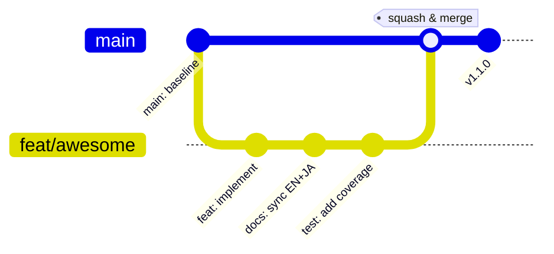
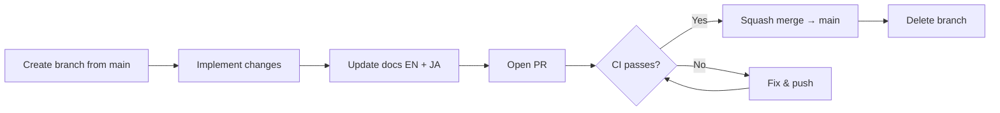
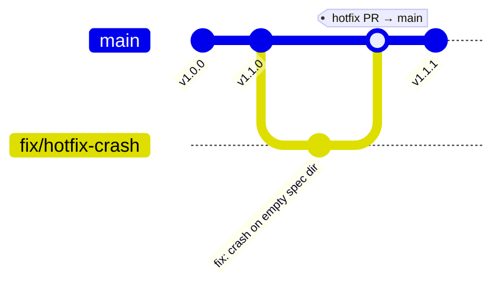

# Branching Strategy

> **Date:** 2026-07-28
> **Version:** 1.0.0

## 1. Overview

specbridge follows a **trunk-based development** model with short-lived topic branches. The primary branch `main` is always in a releasable state — all quality gates (tests, lint, type check, traceability drift) must pass before merging.

This strategy is designed for a single-developer project in alpha/beta phase. It keeps overhead low while maintaining code quality and traceability discipline.



## 2. Permanent Branches

| Branch | Purpose | Protection |
|--------|---------|------------|
| `main` | Always releasable. All CI gates must pass. | Protected — pre-push hook blocks direct push |

Only one permanent branch exists. All development happens on short-lived topic branches and merges back to `main` via pull request.

### 🔒 Enforced by Git Hooks

Two automated hooks protect the workflow:

| Hook | What it does | Blocked if |
|------|-------------|------------|
| **pre-commit** (`pre-commit.specbridge.sh`) | Validates branch name follows convention | `xyz/abc` doesn't match `feat/`, `fix/`, `chore/`, etc. |
| **pre-push** (`pre-push.specbridge.sh`) | Blocks direct pushes to `main` or `master` | `git push origin main` without `--no-verify` |

Install both with:

```bash
sh scripts/install-hooks.sh
```

## 3. Branch Naming Convention

| Prefix | Scope | Commit type |
|--------|-------|-------------|
| `feat/<description>` | New feature, user-facing change | `feat:` |
| `fix/<description>` | Bug fix | `fix:` |
| `chore/<description>` | CI, maintenance, refactoring | `chore:` / `refactor:` |
| `docs/<description>` | Documentation-only changes | `docs:` |
| `dependabot/**` | Auto-created by Dependabot | `chore:` |

Use **kebab-case** for descriptions. Keep branches short and focused — one logical change per branch.

Examples:
- `feat/graphify-adapter`
- `fix/setup-installer-bugs`
- `chore/pre-commit-docs-check`
- `docs/branching-strategy`

## 4. Workflow



### 4.1 Create a branch

Always branch from the latest `main`:

```bash
git checkout main
git pull
git checkout -b feat/my-feature
```

### 4.2 Make changes

Follow the [AGENTS.md](../AGENTS.md) workflow:

1. Code changes
2. 📚 **Documentation sync (EN + JA)** — mandatory before commit
3. Update SKILL.md if Hermes-relevant behavior changed
4. Run `specbridge drift --gate` to verify traceability
5. Run `pytest tests/ -q && mypy specbridge/ --strict`

### 4.3 Open a pull request

All changes — including single-developer changes — go through a PR. This ensures:

- CI runs automatically (tests + lint + type check + trace gate)
- The traceability gate catches drift before it reaches `main`
- `main` history stays clean via squash merge
- Changes are reviewable later

PR title should be a conventional commit message:

```
feat: add graphify adapter for deep AST analysis (#45)
fix: resolve setup script path resolution on MacOS (#42)
docs: document branching strategy (#12)
```

### 4.4 Merge & cleanup

Always **squash merge** to `main`, then delete the branch:

```bash
# Done via GitHub PR interface
# Delete local branch after merge
git checkout main
git pull
git branch -d feat/my-feature
```

## 5. Direct Push Exceptions

Single-developer projects shouldn't be bureaucratic. The following changes may be pushed directly to `main` **without a PR**:

| Change type | Example | Exception condition |
|-------------|---------|-------------------|
| Typo fixes | README typo, comment fix | CI passes, no spec/code logic change |
| CI config | Workflow YAML tweaks | Verified working |
| Documentation | Minor doc fixes | No spec content change, only formatting |

**Always PR** when the change:
- Modifies specbridge source code (`specbridge/`)
- Modifies test logic (`tests/`)
- Affects traceability (spec content, code-spec mapping)
- Is a new feature or fix
- Requires a trace gate pass

When in doubt, **open a PR**. CI will run either way.

## 6. Release Process

### 6.1 Versioning

specbridge follows **Semantic Versioning** (semver):

| Version | Phase | Example |
|---------|-------|---------|
| `0.x.0` | Initial development (pre-1.0) | `0.2.0` |
| `1.x.x` | Stable API | `1.1.0` |
| `x.x.y-pre` | Pre-release | `1.1.0-alpha.1` |

### 6.2 Tagging

Releases are tagged on `main`:

```bash
git tag -a v1.1.0 -m "v1.1.0 — Graphify adapter integration"
git push origin v1.1.0
```

### 6.3 CHANGELOG

Keep a human-readable `CHANGELOG.md` that summarizes notable changes per release:

```
# Changelog

## v1.1.0 (2026-07-28)

### Added
- Graphify adapter for deep AST-based code graph (#45)

### Fixed
- Setup script path resolution on macOS (#42)

### Changed
- Upgraded CI to actions/checkout@v7
```

Conventional commit messages make changelog generation straightforward.

## 7. Hotfix Flow

For urgent fixes to a released version:

1. Branch from the tag: `git checkout -b fix/hotfix-description v1.1.0`
2. Apply the fix
3. PR → CI → squash merge to `main`
4. Tag the new patch version: `git tag -a v1.1.1 -m "v1.1.1 — ..."`



## 8. CI Gates

Every PR to `main` triggers:

1. **ci.yml** — Ruff lint → mypy type check → pytest (3 Python versions)
2. **specbridge-trace.yml** — Snapshot → drift gate → coverage report → HTML trace artifact

All must pass green before merge.

## 9. Branch Protection Rules (GitHub)

Recommended settings for `main`:

- ☐ Require pull request before merging
- ☐ Require status checks (ci / test, trace / trace-gate)
- ☐ Require branches to be up-to-date
- ☐ Do not allow bypassing (for single-dev, this can be relaxed)
- ☐ Include administrators

*(Set these when the project becomes public. For private beta, optional.)*
