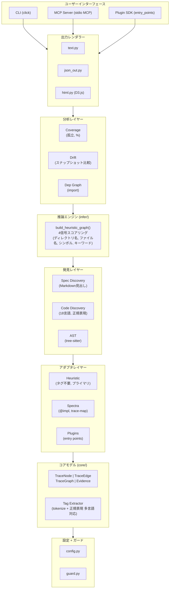
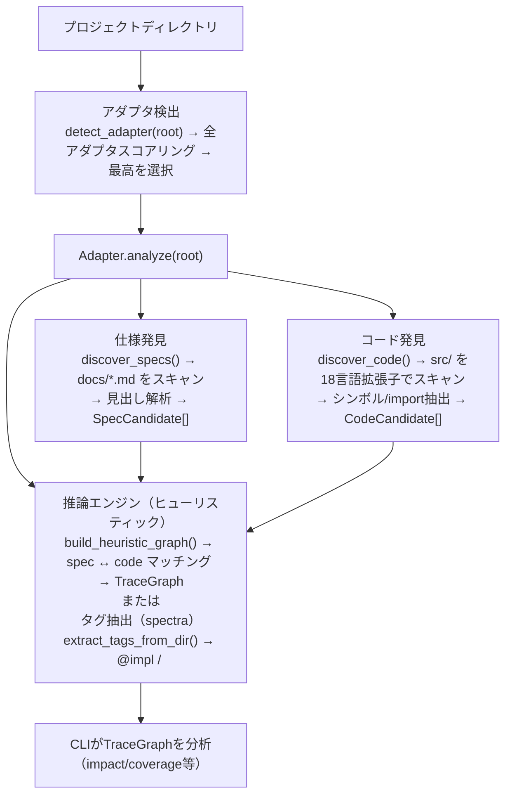
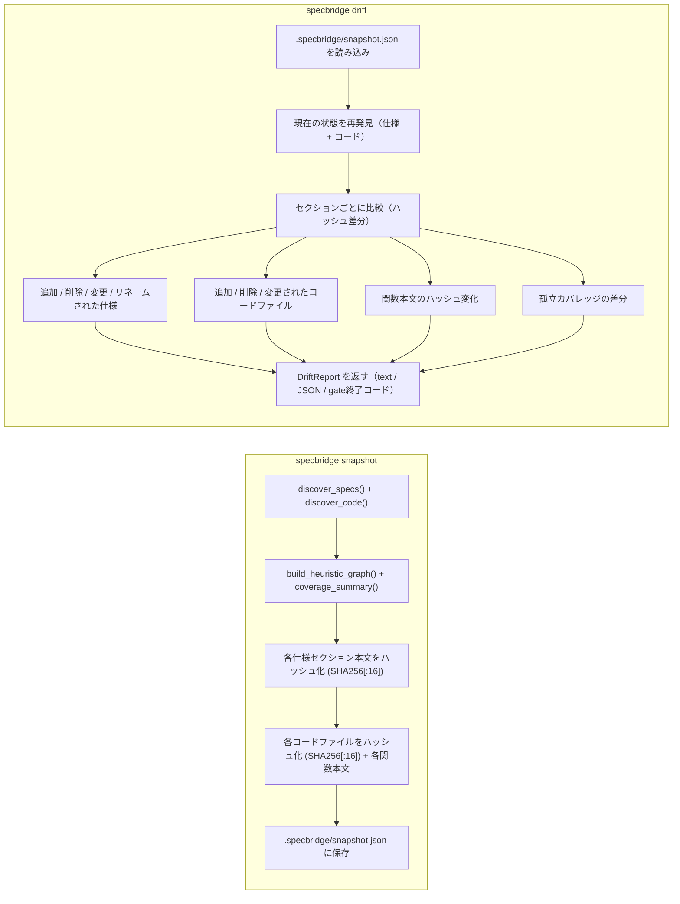
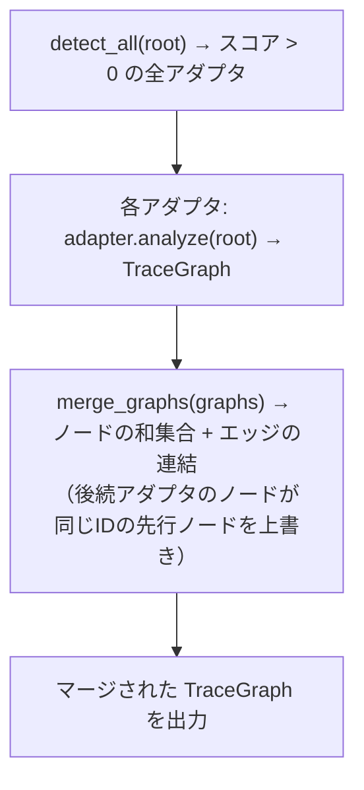

# アーキテクチャ概要

> **日付:** 2026-07-26
> **バージョン:** 0.0.1.dev0

## 1. 目的

specbridgeは**フレームワーク非依存、読み取り専用のトレーサビリティ分析ツール**です。仕様書とソースコードの関係をマッピングします。仕様書やコードを一切変更せず、すべての出力は`.specbridge/`に書き込まれます。

## 2. 全体アーキテクチャ



## 3. モジュール責務

| モジュール | 責務 | 主要エクスポート |
|-----------|------|----------------|
| `core/` | データモデル定義、ファイルからのタグ抽出 | `TraceNode`, `TraceEdge`, `TraceGraph`, `Tag`, `extract_tags_from_dir()` |
| `adapters/` | フレームワーク固有のプロジェクト分析、プラグイン発見 | `ProjectAdapter`, `detect_adapter()`, `merge_graphs()`, `register()` |
| `discovery/` | 仕様書(Markdown)とコード(多言語)を解析して候補に変換 | `SpecCandidate`, `CodeCandidate`, `discover_specs()`, `discover_code()` |
| `infer/` | 仕様とコードのヒューリスティックマッチング | `build_heuristic_graph()` |
| `analyzers/` | カバレッジ統計、孤立検出、ドリフト比較、依存関係グラフ | `coverage_summary()`, `find_orphan_*()`, `compute_drift()`, `build_code_dependency_graph()` |
| `outputs/` | TraceGraph を text / JSON / HTML にレンダリング | `render_text()`, `render_json()`, `render_html()` |
| `cli.py` | ClickベースCLIエントリポイント | `cli` グループ、9コマンド |
| `mcp_server.py` | AIエージェント統合のためのMCPプロトコルサーバ | `create_mcp_server()`, `run_mcp_server()` |
| `config.py` | `.specbridge.yaml` / `pyproject.toml` からの設定読み込み | `SpecbridgeConfig.load()` |
| `guard.py` | 書き込みパスが `.specbridge/` 内であることを検証 | `validate_write_path()` |

## 4. データフロー
<!-- @impl specbridge/outputs/html.py::_graph_data -->
<!-- @impl tests/conftest.py::generate_chart -->

### 読み取りパス（メインフロー）



### スナップショット / ドリフトフロー



### アダプタマージフロー



## 5. 設計原則

| 原則 | 実装 |
|------|------|
| **読み取り専用** | `guard.py` が `.specbridge/` 外への書き込みをブロック。スナップショット/ドリフト出力は `.specbridge/snapshot.json` のみ。 |
| **フレームワーク非依存** | `ProjectAdapter` ABCによるアダプタパターン。標準搭載: heuristic + spectra。`entry_points` プラグインで拡張可能。 |
| **タグ不要優先** | HeuristicAdapter がプライマリ（常に最初にロード）。タグベースのアダプタはオプションの拡張。 |
| **多言語対応** | 18言語を正規表現でシンボル抽出。Pythonはオプションでtree-sitter ASTによる高精度解析。 |
| **信頼度スコア** | すべてのエッジに `EdgeStrength` (EXPLICIT > INFERRED > WEAK) と証拠ソース。ユーザーは関係が *なぜ* 推論されたかを確認可能。 |
| **ハッシュベースドリフト** | 3層ハッシュ化: ファイルレベル、関数レベル、セクションレベル。変更箇所のみ報告（フル再スキャン不要）。 |

## 6. 依存関係

### ランタイム
- `click>=8.1` — CLIフレームワーク
- `rich>=13.0` — ターミナルフォーマット
- `pyyaml>=6.0` — YAML設定

### オプション
- `watchdog>=4.0` — `specbridge watch` コマンド
- `mcp>=1.0` — MCPサーバ
- `tree-sitter>=0.21`, `tree-sitter-python>=0.21` — ASTベースPython解析

### 開発
- `pytest`, `pytest-cov`, `mypy`, `ruff`, `types-PyYAML`

## 7. ファイルレイアウト

```
specbridge/
├── __init__.py          # バージョン
├── cli.py               # CLI: 9コマンド
├── config.py            # 設定読み込み
├── guard.py             # 書き込みパスガード
├── mcp_server.py        # MCPプロトコルサーバ
├── adapters/
│   ├── __init__.py      # 再エクスポート + 先行インポート
│   ├── _base.py         # ABC + レジストリ + プラグイン発見 + マージ
│   ├── heuristic.py     # HeuristicAdapter
│   └── spectra.py       # SpectraAdapter
├── analyzers/
│   ├── __init__.py      # coverage_summary, 孤立検出
│   ├── drift.py         # スナップショット + ドリフトエンジン
│   └── graph.py         # コード依存関係グラフ
├── core/
│   ├── __init__.py      # データモデル (TraceNode, TraceEdge, TraceGraph, 列挙型)
│   └── extract.py       # タグ抽出 (tokenize + 正規表現)
├── discovery/
│   ├── __init__.py
│   ├── ast.py           # Tree-sitter AST (Python)
│   ├── code.py          # コード発見 (18言語)
│   └── spec.py          # 仕様発見 (Markdown見出し)
├── infer/
│   └── __init__.py      # ヒューリスティックグラフ構築
└── outputs/
    ├── __init__.py
    ├── html.py          # D3.js HTML出力
    ├── json_out.py      # JSON出力
    └── text.py          # テキスト出力
tests/
├── __init__.py
├── conftest.py
├── test_adapter_merge.py
├── test_analyzers.py
├── test_ast.py
├── test_boundary.py
├── test_code_discovery.py
├── test_config.py
├── test_drift.py
├── test_extract.py
├── test_guard.py
├── test_heuristic_adapter.py
├── test_import_graph.py
├── test_plugin_discovery.py
└── test_spectra_adapter.py
```
