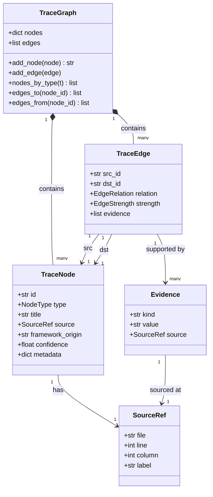

# データモデル

> **日付:** 2026-07-26
> **バージョン:** 0.0.1.dev0

## 1. 概要

コアデータモデルは、トレーサビリティグラフを形成する3つの主要な型で構成されます：

```
TraceGraph
 ├── nodes: dict[str, TraceNode]    — すべてのトレース可能要素
 └── edges: list[TraceEdge]          — ノード間の関係
```

## 2. 型階層

### 2.1 TraceNode

トレース可能なあらゆるものを表します：仕様書、設計書、コードファイル、テストファイル、タスク。

```python
@dataclass
class TraceNode:
    id: str                    # 安定ID（例："1.1", "auth-login"）
    type: NodeType             # SPEC, DESIGN, CODE, TEST, TASK
    title: str                 # 人間可読な名前
    source: SourceRef          # 物理的な場所
    framework_origin: str      # "spectra", "heuristic", "cc-sdd" など
    confidence: float = 1.0    # 0.0〜1.0
    metadata: dict = {}        # 拡張可能なキー-バリューストア
```

**NodeType 列挙型:**

| 値 | 説明 | 使用元 |
|-----|------|--------|
| `SPEC` | 仕様書（Markdown見出し） | HeuristicAdapter, SpectraAdapter |
| `DESIGN` | 設計書やアノテーション | SpectraAdapter（`@design`, `@satisfies`） |
| `CODE` | ソースコードファイル | 全アダプタ |
| `TEST` | テストファイル | HeuristicAdapter（ファイル名パターン）, SpectraAdapter（`@verifies`） |
| `TASK` | タスクや課題（未実装） | 将来の利用のために予約 |

**IDの命名規則:**

| アダプタ | フォーマット | 例 |
|----------|-------------|-----|
| ヒューリスティック | `{file_stem}.{階層番号}` | `auth.1.2` |
| Spectra（マッピング） | `trace-mapping.yaml` の `id` フィールド | `AUTH-1` |
| Spectra（インライン） | `spec::{値}` | `spec::AUTH-1` |
| コードノード | `{ファイルパス}` | `src/auth/login.py` |
| コード（マッピング） | `{spec_id}::{ファイルパス}` | `AUTH-1::src/auth/login.py` |

### 2.2 TraceEdge

2つのトレースノード間の有向関係。

```python
@dataclass
class TraceEdge:
    src_id: str                # ソースノードID
    dst_id: str                # 宛先ノードID
    relation: EdgeRelation     # 関係の種類
    strength: EdgeStrength     # 信頼度レベル
    evidence: list[Evidence]   # このエッジの根拠
```

**EdgeRelation 列挙型:**

| 値 | 方向 | 意味 |
|-----|-------|-------|
| `IMPLEMENTS` | code → spec | コードファイルが仕様を実装 |
| `VERIFIES` | test → spec | テストが仕様を検証 |
| `SATISFIES` | design → spec | 設計が仕様を充足 |
| `DEPENDS` | code → code | コードファイルが他に依存（importから） |
| `REFERENCES` | any → any | 汎用参照（その他すべて） |

**EdgeStrength 列挙型:**

| 値 | 意味 | 主な発生源 |
|------|-------|-------------|
| `EXPLICIT` | ユーザーが明示的に宣言 | タグアノテーション（`@impl`, `@verifies`）、マッピングファイル |
| `INFERRED` | 妥当な確信度で推論 | スコア0.4以上のヒューリスティックマッチング |
| `WEAK` | 推測的な関係 | スコア0.4未満のヒューリスティックマッチング |

### 2.3 補助型

**SourceRef** — 物理的な場所を指します：

```python
@dataclass
class SourceRef:
    file: str                 # プロジェクトルートからの相対パス
    line: int | None = None   # 1始まりの行番号
    column: int | None = None # 0始まりのカラム
    label: str | None = None  # 例：見出し名、関数名
```

**Evidence** — トレースエッジが存在する理由：

```python
@dataclass
class Evidence:
    kind: str                 # 例："tag:impl", "heuristic:filename", "ast:call"
    value: str                # 抽出された値（例："1.1", "login"）
    source: SourceRef         # この証拠が見つかった場所
```

**Evidence kind 分類:**

| 種類 | 意味 | 強度レベル |
|------|------|------------|
| `tag:impl` | 明示的な `@impl` アノテーション | EXPLICIT |
| `tag:verifies` | 明示的な `@verifies` アノテーション | EXPLICIT |
| `tag:spec` | 明示的な `<!-- @spec -->` アノテーション | EXPLICIT |
| `tag:satisfies` | 明示的な `<!-- @satisfies -->` アノテーション | EXPLICIT |
| `mapping` | `.spectra/trace-mapping.yaml` からの明示的定義 | EXPLICIT |
| `heuristic:dirname` | ディレクトリ名の一致 | INFERRED / WEAK |
| `heuristic:filename` | ファイル名（ステム）の一致 | INFERRED / WEAK |
| `heuristic:symbol` | シンボルと見出しキーワードの重複 | INFERRED / WEAK |
| `heuristic:keyword` | 見出しとファイルステムキーワードの重複 | INFERRED / WEAK |
| `import_graph` | import文からのコード依存関係 | INFERRED |

### 2.4 TraceGraph

分析結果のトップレベルコンテナ。

```python
@dataclass
class TraceGraph:
    nodes: dict[str, TraceNode] = field(default_factory=dict)
    edges: list[TraceEdge] = field(default_factory=list)
```

**メソッド:**

| メソッド | シグネチャ | 説明 |
|----------|------------|------|
| `add_node` | `(node: TraceNode) -> str` | ノードを追加、IDを返す |
| `add_edge` | `(edge: TraceEdge) -> None` | エッジを追加 |
| `nodes_by_type` | `(t: NodeType) -> list[TraceNode]` | タイプでノードをフィルタ |
| `edges_to` | `(node_id: str) -> list[TraceEdge]` | このノードへの全エッジ（入力） |
| `edges_from` | `(node_id: str) -> list[TraceEdge]` | このノードからの全エッジ（出力） |

## 3. 発見処理の中間型

TraceNodeに変換される前の中間表現。

### 3.1 SpecCandidate

```python
@dataclass
class SpecCandidate:
    file: str
    heading_depth: int          # 1-6
    heading_text: str           # 生の見出しテキスト
    auto_id: str                # 生成ID（例："auth.1.2"）
    title: str                  # クリーンなタイトル
    line: int                   # 1始まり
    body_text: str              # セクション全文（見出し＋本文）
    body_hash: str              # body_text の SHA256[:16]
    body_hash_content: str      # 見出し行を除いた本文の SHA256[:16]
    body_line_count: int        # 本文の行数（見出し除く）
    body_preview: str           # 最初の80文字
```

**自動ID生成:**

```
入力:  "## 1.2 Login" in docs/auth/auth.md
出力: auto_id = "auth.auth.1.2"
         title   = "Login"

アルゴリズム:
  1. 接頭辞 = 親ディレクトリ.ファイルステム（例："auth.auth"）
  2. 見出し階層スタックからの階層番号（例："1.2"）
  3. 番号なし見出しの場合：見出しテキストをスラグ化
```

### 3.2 CodeCandidate

```python
@dataclass
class CodeCandidate:
    file: str                   # プロジェクトルートからの相対パス
    module: str                 # 親ディレクトリ名
    symbols: list[str]          # 関数/クラス/構造体名
    is_test: bool               # ファイル名パターンから検出
    language: str               # 人間可読な言語名
    imports: list[str]          # 最初の8件のimportパス
    line_count: int
    functions: list[FuncBlock]  # 関数ごとの本文ハッシュ
    file_hash: str              # ファイル全体の SHA256[:16]
```

### 3.3 FuncBlock

```python
@dataclass
class FuncBlock:
    name: str                   # 関数/クラス/メソッド名
    kind: str                   # "function", "class", "method"
    line: int                   # 1始まりの開始行
    body_hash: str              # 関数本文の SHA256[:16]
    body_lines: int
    body_preview: str           # 最初の80文字
```

### 3.4 Tag（`core/extract.py` より）

```python
@dataclass
class Tag:
    kind: str                   # "impl", "module", "feature", "verifies", "spec",
                                # "design", "satisfies", "boundary"
    value: str                  # パースされた値
    file: str                   # 相対パス
    line: int                   # 1始まり
    col: int = 0
```

## 4. ドリフト検出の型

### 4.1 DriftReport

```python
class DriftReport:
    specs_added: list[dict]
    specs_removed: list[dict]
    specs_changed: list[dict]        # タイトル変更
    specs_body_changed: list[dict]   # 本文変更、タイトルは同じ
    specs_renamed: list[dict]        # 削除＋追加（body_hash_contentが同じ）
    code_added: list[dict]
    code_removed: list[dict]
    code_symbols_changed: list[dict]
    code_funcs_changed: list[dict]   # 関数本文ハッシュ変更
    new_orphan_specs: list[str]
    resolved_orphan_specs: list[str]
    new_orphan_code: list[str]
    resolved_orphan_code: list[str]
    coverage_before: dict | None
    coverage_after: dict | None

    @property
    def has_drift(self) -> bool: ...

    def render_text(self) -> str: ...

    def to_dict(self) -> dict: ...
```

## 5. 設定型

### 5.1 SpecbridgeConfig

```python
@dataclass
class SpecbridgeConfig:
    spec_dirs: list[str]        # デフォルト: ["docs", "spec", "specs"]
    source_dirs: list[str]      # デフォルト: ["src", "lib", "app"]
    exclude_dirs: set[str]      # デフォルト: [".git", "node_modules", ".venv", ...]
    min_confidence: float       # デフォルト: 0.15
    max_output_nodes: int       # デフォルト: 20（--top による切り捨て）

    @classmethod
    def load(cls, project_dir: str | Path) -> SpecbridgeConfig: ...
```

## 6. 関係図



## 7. シリアライゼーション

データモデルは dataclass イントロスペクションを介してJSONにシリアライズされます：

```python
def render_json(graph: TraceGraph) -> str:
    payload = {
        "specbridge_version": "0.0.1.dev0",
        "nodes": [_node_dict(n) for n in graph.nodes.values()],
        "edges": [_edge_dict(e) for e in graph.edges],
    }
    return json.dumps(payload, ...)
```

`_node_dict` と `_edge_dict` は列挙値を `.value` で文字列に変換します。
