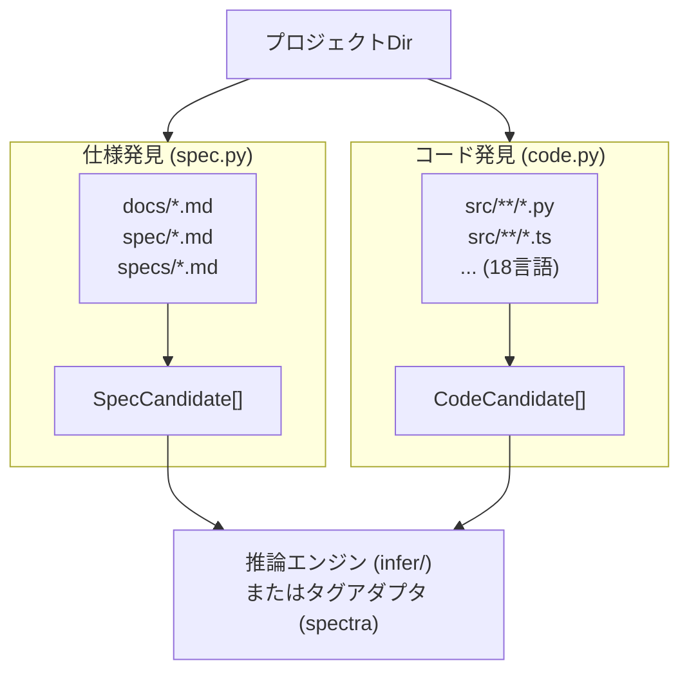

# 発見エンジン

> **日付:** 2026-07-26
> **バージョン:** 0.0.1.dev0

## 1. 概要
<!-- @impl specbridge/adapters/_base.py::ProjectAdapter -->
<!-- @impl specbridge/adapters/_base.py::all_adapters -->
<!-- @impl specbridge/adapters/_base.py::detect_adapter -->
<!-- @impl tests/conftest.py::tmp_project_heuristic -->

発見レイヤーはプロジェクトディレクトリをスキャンし、仕様書とソースコードファイルの**候補**を抽出する役割を担います。これらの候補は推論エンジン（ヒューリスティックマッチング用）またはタグベースのアダプタによって消費されます。



## 2. 仕様発見 (`discovery/spec.py`)

### 2.1 機能

指定された仕様ディレクトリ（`docs/`, `spec/`, `specs/`）内のMarkdownファイル（`.md`）をスキャンし、見出し階層を `SpecCandidate` オブジェクトにパースします。各見出しが1つの仕様候補になります。

### 2.2 検索パス

| 設定 | デフォルト | 説明 |
|------|-----------|------|
| `spec_dirs` | `["docs", "spec", "specs"]` | 仕様Markdownファイルをスキャンするディレクトリ |

除外ディレクトリは `_EXCLUDE_DIRS` で定義され、`.git`, `node_modules`, `.venv`, `__pycache__`, `dist`, `build`, `.spectra`, `.specbridge`, `.artgraph`, `.trace` などが含まれます。

除外ファイルには `README.md`, `CHANGELOG.md`, `CONTRIBUTING.md`, `LICENSE.md`, `index.md`, `_sidebar.md`, `_navbar.md` が含まれます。

### 2.3 セクション分割アルゴリズム

```python
def _split_sections(text: str) -> list[dict]:
    """Markdownを見出し行でセクションに分割。
    戻り値: [{line, depth, 生見出しテキスト, 本文テキスト}]"""
```

アルゴリズムはすべての行を反復処理し、`#{1,6} heading` パターンで見出しを検出します。各セクションの本文は、この見出しから次の見出し（任意の深さ）またはEOFまでのテキストです。

### 2.4 自動ID生成

仕様候補には、以下の要素に基づいて自動生成された安定IDが割り当てられます：

1. **ファイルベースの接頭辞**: `{親ディレクトリ}.{ファイルステム}.`
   - 例: `docs/auth/auth.md` → 接頭辞 = `auth.auth.`

2. **階層番号**: 見出しの深さスタックから
   - `# Section` → `1`
   - `## Subsection` → `1.1`
   - `### Detail` → `1.1.1`
   - `## Another` → `1.2`

3. **最終的な auto_id**: `{接頭辞}{階層番号}`
   - 例: `auth.auth.1.2`

4. **番号なし見出しの場合**: 見出しテキストがスラグ化されて英数字IDに変換される
   - `## User Login` → slug = `user-login`

### 2.5 ドリフト検出のための本文ハッシュ

各仕様セクションの本文はドリフト比較のためにSHA256（最初の16進16桁）でハッシュ化されます：

- **`body_hash`**: セクション本文全体のSHA256（見出し行＋本文テキスト）
- **`body_hash_content`**: 見出し行を**除いた**本文テキストのSHA256（リネーム検出に使用）

### 2.6 SpecCandidate の出力

```python
@dataclass
class SpecCandidate:
    file: str               # 相対パス 例："docs/auth/auth.md"
    heading_depth: int      # 1–6
    heading_text: str       # 生見出しテキスト 例："## 1.2 Login"
    auto_id: str            # 例："auth.auth.1.2"
    title: str              # クリーン 例："Login"
    line: int               # 1始まり
    parent_chain: list[str] | None  # 例：["データモデル", "型階層"]
    body_text: str          # セクション全文
    body_hash: str          # SHA256[:16]
    body_hash_content: str  # 見出し行なしのSHA256[:16]
    body_line_count: int    # 見出し後の行数
    body_preview: str       # 最初の80文字
```

## 3. コード発見 (`discovery/code.py`)

### 3.1 機能

ソースコードディレクトリ（`src/`, `lib/`, `app/`）を18のプログラミング言語にわたってスキャンします。シンボル（関数、クラス）、インポートを抽出し、関数レベルの本文ハッシュを作成します。

### 3.2 対応言語（18言語）

| 拡張子 | 言語 | コメント形式 |
|--------|------|-------------|
| `.py` | Python | `#` |
| `.rb` | Ruby | `#` |
| `.sh`, `.bash`, `.zsh` | Shell | `#` |
| `.ts`, `.tsx` | TypeScript/TSX | `//` |
| `.js`, `.jsx` | JavaScript/JSX | `//` |
| `.go` | Go | `//` |
| `.rs` | Rust | `//` |
| `.cpp`, `.hpp` | C++ | `//` |
| `.c`, `.h` | C | `//` |
| `.cs` | C# | `//` |
| `.java` | Java | `//` |
| `.kt` | Kotlin | `//` |
| `.swift` | Swift | `//` |
| `.scala` | Scala | `//` |
| `.dart` | Dart | `//` |
| `.php`, `.phtml` | PHP | `//` |

### 3.3 シンボル抽出

多言語対応の正規表現パターンを使用：

```python
_RE_FUNC_DEF = re.compile(
    r"^"
    r"(?:"
    r"(?:\s*(?:public|private|protected|static|async|export|pub|override"
    r"|abstract|virtual|sealed|internal|open)\s+)*"
    r"(?:def|function|fn|class|trait|interface|struct|enum|impl"
    r"|mixin|extension|typedef|record)"
    r"\s+([A-Za-z_]\w*)"
    r")"
    r".*?(?:\(|: |:|=>|=|{)",        # `(` で複数行シグネチャ対応
    re.MULTILINE,
)
```

この正規表現は以下を処理します：
- **Python**: `def login():`, `class User:`, `def build_graph(`（複数行パラメータ）
- **TypeScript**: `function login()`, `class User {`
- **Go**: `func Login()`, `type User struct {`
- **Rust**: `fn login()`, `struct User`

`(` を終端文字に追加した理由は、`def build_heuristic_graph(\n    project_dir: str, ...` のように `def` 行に `:`、`=>`、`=`、`{` が含まれない複数行関数シグネチャをキャプチャするためです。
- **Java**: `public class User`, `void login()`
- その他多数

### 3.4 インポート抽出

言語固有の正規表現で、ファイルごとに最大8つのインポートパスを抽出：

- **Python**: `import X`, `from X import Y`
- **TypeScript/JavaScript**: `import X from 'Y'`, `require('Y')`
- **Rust**: `use X::Y`

### 3.5 関数本文のハッシュ化

各関数/クラス定義は `FuncBlock` として抽出され、独自の本文ハッシュを持ちます：

```python
def _extract_func_blocks(text, lines):
    """すべての関数/クラス定義を検出し、本文テキストを抽出し、
    それぞれに SHA256[:16] ハッシュを計算する。"""
```

関数本文は定義行から次の定義行の前（またはEOF）までの範囲です。これにより**関数単位のドリフト検出**が可能になります。

### 3.6 テストファイル検出

ファイル名パターンに基づいてテストとしてマーク：
- `test_*`, `*_test`, `*.test.*`, `*.spec.*`, `*Test*`, `*_spec.*`

### 3.7 CodeCandidate の出力

```python
@dataclass
class CodeCandidate:
    file: str               # 相対パス 例："src/auth/login.py"
    module: str             # 親ディレクトリ名 例："auth"
    symbols: list[str]      # 抽出されたシンボル 例：["login", "User"]
    is_test: bool           # テストパターンに一致する場合True
    language: str           # "Python", "TypeScript" など
    imports: list[str]      # 最大8件のインポートパス
    line_count: int         # 総行数
    functions: list[FuncBlock]  # 関数ごとの本文ハッシュ
    file_hash: str          # ファイル全体の SHA256[:16]
```

### 3.8 除外ルール

スキャンから除外されるディレクトリ：`.git`, `node_modules`, `.venv`, `__pycache__`, `dist`, `build`, `.spectra`, `.specbridge`, `.artgraph`, `.trace`, `venv`, `env`, `.tox`, `.mypy_cache`, `.ruff_cache`, `.pytest_cache`, `.egg-info`, `site-packages`, `coverage`, `htmlcov`

## 4. ASTベース拡張 (`discovery/ast.py`)

より正確なPython分析のための**tree-sitter**を使用したオプションの拡張：

```python
# インストール: pip install specbridge[ast]
# tree-sitter Pythonグラマーによる正確なAST解析を提供
```

### 使用タイミング

- **tree-sitter利用可能**（推奨）：ネストされた関数、デコレータ、複雑な構文を正確に処理
- **tree-sitter利用不可**（フォールバック）：`code.py` の正規表現ベース `_extract_func_blocks()` にフォールバック

### アーキテクチャ

```
extract_functions_python(file_path)
    │
    ├──▶ Tree-sitter利用可能？
    │       YES → tree-sitter-python グラマーで解析
    │              → ASTを走査（function_definition, class_definition）
    │              → 本文テキスト + ハッシュを抽出
    │
    └──▶ NO → _extract_functions_regex_fallback() にフォールバック
                 → code.py の正規表現アプローチを使用
```

**深さ制限**: ASTの走査は200レベルに制限され、異常な入力による無限再帰を防止します。

## 5. タグ抽出 (`core/extract.py`)

厳密には発見パイプラインの一部ではありませんが、タグ抽出は密接に関連しています。ソースファイルと仕様ファイルの両方からアノテーションタグをスキャンします。

### 抽出戦略

| ファイルタイプ | 方法 | 理由 |
|--------------|------|------|
| Python (`.py`) | `tokenize` | 文字列リテラル（f-strings, docstrings）内のタグを誤認識しないため |
| その他のソース | 正規表現 | 高速、トークナイザーによる誤検出なし |
| Markdown (`.md`, `.mdx`, `.rst`) | HTMLコメント正規表現 | `<!-- @spec -->` 形式のアノテーション用 |

### 抽出されるタグの種類

| タグ種別 | ソース | 例 |
|----------|--------|-----|
| `impl` | ソースコード (`#`, `//`) | `# @impl 1.1` |
| `module` | ソースコード (`#`, `//`) | `# @module auth` |
| `feature` | ソースコード (`#`, `//`) | `# @feature login` |
| `verifies` | テストコード (`#`, `//`) | `# @verifies 1.1` |
| `spec` | Markdown (`<!-- -->`) | `<!-- @spec 1 -->` |
| `design` | Markdown (`<!-- -->`) | `<!-- @design AuthService -->` |
| `satisfies` | Markdown (`<!-- -->`) | `<!-- @satisfies AUTH-1 -->` |
| `boundary` | Markdown（行頭） | `_Boundary:_ src/path/` |
