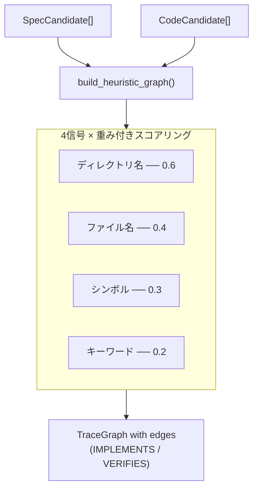

# ヒューリスティックマッチングエンジン

> **日付:** 2026-07-26
> **バージョン:** 0.0.1.dev0

## 1. 概要

ヒューリスティックマッチングエンジン（`infer/__init__.py`）は**タグ不要優先**アプローチの中核です。仕様書とコードの候補を発見し、4つの構造的信号を使ってそれらの関係を推論して `TraceGraph` を構築します — **タグやアノテーションは一切不要**です。



## 2. アルゴリズム: `build_heuristic_graph()`

```python
def build_heuristic_graph(
    project_dir: str,
    *,
    specs: list[SpecCandidate] | None = None,
    codes: list[CodeCandidate] | None = None,
    spec_dirs: list[str] | None = None,
    source_dirs: list[str] | None = None,
) -> TraceGraph:
```

**手順:**

### ステップ1: 候補を発見

`specs`/`codes` が事前に提供されていない場合、以下を実行：
- `discover_specs(project_dir, spec_dirs)` → `SpecCandidate[]`
- `discover_code(project_dir, source_dirs)` → `CodeCandidate[]`

これにより、呼び出し元（ドリフト検出など）は事前計算済みの候補を渡して重複スキャンを回避できます。

### ステップ2: TraceNodes に変換

各 `SpecCandidate` → `TraceNode(type=SPEC, framework_origin="heuristic")`
各 `CodeCandidate` → `TraceNode(type=CODE or TEST, framework_origin="heuristic")`

### ステップ3: すべての spec–code ペアをスコアリング

各 `SpecCandidate` × `CodeCandidate` ペアについて、4つの信号を使用して信頼度スコアを計算：

```
confidence = weighted_score / total_weight
```

`confidence >= _MIN_CONFIDENCE (0.15)` の場合、エッジをグラフに追加。

## 3. 4つの信号

### 3.1 ディレクトリ名マッチング（`_W_DIRNAME = 0.6`）

仕様ファイルとコードファイルの直接の親ディレクトリ名を比較。

**スコアリング:**
- **完全一致**（両方が `auth/` 配下）: conf = 1.0 × 重み
- **部分一致**（`auth/` ↔ `authentication/`）: conf = 0.6 × 重み
- **不一致**: conf = 0.0

### 3.2 ファイル名マッチング（`_W_FILENAME = 0.4`）

仕様ファイルとコードファイルのステム（拡張子を除いたファイル名）を比較。

**スコアリング:**
- **完全一致**（`login.md` ↔ `login.py`）: conf = 1.0 × 重み
- **部分一致**（`login.md` ↔ `login_helper.py`）: conf = 0.5 × 重み
- **不一致**: conf = 0.0

### 3.3 シンボル ↔ 見出しキーワード重複（`_W_SYMBOL = 0.3`）

コードから抽出したシンボル（関数名/クラス名）と、仕様の見出しテキストをトークン化したものとを比較。

**スコアリング:**
```
overlap = spec_tokens & code_tokens
jaccard = len(overlap) / len(spec_tokens | code_tokens)
conf = min(jaccard × 3, 1.0) × 重み
```

×3の乗数により、部分的な一致が迅速に1.0に近づきます。

### 3.4 見出し ↔ ファイルステムキーワード重複（`_W_KEYWORD = 0.2`）

トークン化された仕様見出しテキストと、トークン化されたコードファイルのステムを比較。

**スコアリング:** シンボルマッチングと同じJaccardベースの式で、×3ブースト。

### 処理の詳細

```python
def _score_edge(sc, cc, spec_tokens, project_dir):
    evidence = []
    total_weight = 0.0
    weighted_score = 0.0

    # 信号1: ディレクトリ名
    if spec_dir and code_dir and spec_dir == code_dir:
        weighted_score += 0.6 * 1.0       # 完全一致
    elif spec_dir in code_dir or code_dir in spec_dir:
        weighted_score += 0.6 * 0.6       # 部分一致
    total_weight += 0.6

    # 信号2: ファイル名
    if spec_stem.lower() == code_stem.lower():
        weighted_score += 0.4 * 1.0       # 完全一致
    elif spec_stem.lower() in code_stem.lower() or ...:
        weighted_score += 0.4 * 0.5       # 部分一致
    total_weight += 0.4

    # 信号3: シンボル重複
    overlap = spec_tokens & code_keywords
    if overlap:
        jaccard = len(overlap) / len(spec_tokens | code_keywords)
        weighted_score += 0.3 * min(jaccard * 3, 1.0)
    total_weight += 0.3

    # 信号4: キーワード重複
    overlap = spec_tokens & file_keywords
    if overlap:
        jaccard = len(overlap) / len(spec_tokens | file_keywords)
        weighted_score += 0.2 * min(jaccard * 3, 1.0)
    total_weight += 0.2

    if total_weight == 0:
        return 0.0, []
    confidence = weighted_score / total_weight
    return round(min(confidence, 1.0), 4), evidence
```

## 4. トークン化

```python
def _tokenize(text: str) -> set[str]:
    """テキストを小文字トークンに分割し、ストップワードを除去。"""
    tokens = set(re.findall(r"[a-zA-Z_][a-zA-Z0-9_]{2,}", text.lower()))
    return tokens - _STOPWORDS
```

**ストップワード**（信号にならない一般的な英単語）:
```
the, a, an, and, or, of, to, in, for, on, is,
are, was, be, has, have, do, does, should, will,
with, as, at, by, from, it, its, this, that
```

3文字以上のトークンのみ保持されます。

## 5. エッジの分類

| 信頼度範囲 | EdgeStrength | EdgeRelation (コード) | EdgeRelation (テスト) |
|-----------|--------------|----------------------|----------------------|
| ≥ 0.4 | `INFERRED` | `IMPLEMENTS` | `VERIFIES` |
| 0.15–0.39 | `WEAK` | `IMPLEMENTS` | `VERIFIES` |
| < 0.15 | （エッジなし） | — | — |

## 6. 設計判断

### なぜ最小値0.15なのか？

最小しきい値（`_MIN_CONFIDENCE = 0.15`）は偽陰性を避けるために意図的に低く設定されています。ユーザーは出力時に `--top N` でフィルタリングでき、エッジの `strength` フィールドによりダウンストリームツールが何を信頼するか判断できます。

### なぜ合計ではなく加重平均なのか？

加重平均は、発火した信号の数に関係なくスコアを0.0〜1.0に正規化します。これにより、1つの信号タイプ（例：ディレクトリ名マッチングのみ）しかないプロジェクトが不利になるのを防ぎます。

### なぜJaccardに×3ブーストなのか？

短いテキスト（見出しは通常2〜5語、ファイルステムは1〜3語）ではJaccard類似度は自然に低くなります。×3乗数は、典型的な重複（例：2/8トークン = 0.25）を有用な範囲（0.75）にマッピングします。

## 7. 証拠チェーン

すべてのエッジは、関係が*なぜ*推論されたかを説明する `Evidence` オブジェクトのリストを持ちます：

```
Edge from "src/auth/login.py" → "auth.auth.1.2"
  Evidence 1: kind="heuristic:dirname", value="dir 'auth' matches"   [仕様ファイルから]
  Evidence 2: kind="heuristic:filename", value="basename 'auth' ≈ 'login' (partial)" [仕様ファイルから]
  Evidence 3: kind="heuristic:keyword", value="keyword overlap: login" [仕様ファイルから]
```

この透明性は中核的な原則であり、ユーザーは推論された各関係の背後にある理由を常に確認できます。

## 8. パフォーマンス特性

- **時間計算量**: O(S × C)（S = 仕様候補数、C = コード候補数）
- **マッチング中のI/Oなし**（すべてのデータは既に発見済み）
- トークン化とJaccard計算は、典型的なプロジェクトサイズ（各500候補未満）ではCPU負荷が軽い

## 9. 入力パラメータ

この関数は、冗長な再発見を避けるために事前計算済みの候補を受け付けます：

```python
# ドリフト検出で使用（スナップショット再発見から既にspecsとcodesを持っている）
build_heuristic_graph(root, specs=curr_specs, codes=curr_codes, spec_dirs=config.spec_dirs, source_dirs=config.source_dirs)
```
