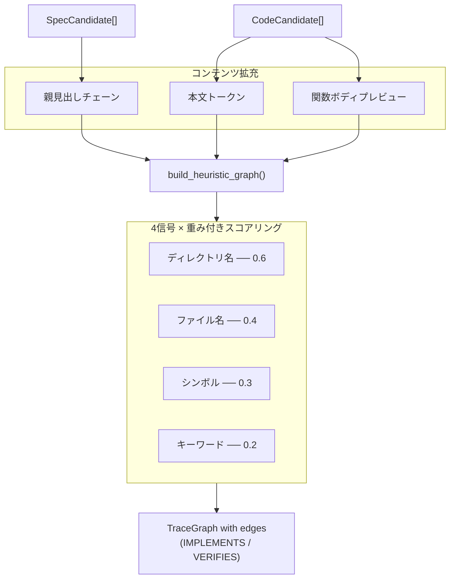

# ヒューリスティックマッチングエンジン

> **日付:** 2026-07-26
> **バージョン:** 0.0.1.dev0

## 1. 概要

ヒューリスティックマッチングエンジン（`infer/__init__.py`）は**タグ不要優先**アプローチの中核です。仕様書とコードの候補を発見し、4つの構造的信号を使ってそれらの関係を推論して `TraceGraph` を構築します — **タグやアノテーションは一切不要**です。



**基本の見出しマッチングからの主な改善点:**

| 拡充 | ソース | 効果 |
|------|--------|------|
| **親見出しチェーン** | 仕様の見出し階層 | 深いセクションが広い文脈を継承（例：「TraceNode」に「Data Model」＋「Type Hierarchy」が追加される） |
| **本文トークン** | 仕様セクションの本文（先頭300文字） | 文章中に登場するクラス名や関数名をキャプチャ |
| **関数ボディプレビュー** | コード関数のdocstring | コードの動作を説明する仕様の文章とマッチング |
| **`__init__.py` → 親ディレクトリ** | コードファイルパス | `core/__init__.py` を `__init__` ではなく `core` としてマッチ |
| **サブセットボーナス** | シンボル × 見出しの重複 | `spec_tokens ⊆ code_keywords` → Jaccardスコアを0.85以上にブースト |

## 2. アルゴリズム: `build_heuristic_graph()`

```python
def build_heuristic_graph(
    project_dir: str,
    *,
    specs: list[SpecCandidate] | None = None,
    codes: list[CodeCandidate] | None = None,
    spec_dirs: list[str] | None = None,
    source_dirs: list[str] | None = None,
) -> TraceGraph:
```

**手順:**

### ステップ1: 候補を発見

`specs`/`codes` が事前に提供されていない場合、以下を実行：
- `discover_specs(project_dir, spec_dirs)` → `SpecCandidate[]`
- `discover_code(project_dir, source_dirs)` → `CodeCandidate[]`

これにより、呼び出し元（ドリフト検出など）は事前計算済みの候補を渡して重複スキャンを回避できます。

### ステップ2: TraceNodes に変換

各 `SpecCandidate` → `TraceNode(type=SPEC, framework_origin="heuristic")`
各 `CodeCandidate` → `TraceNode(type=CODE or TEST, framework_origin="heuristic")`

### ステップ3: 拡充された仕様トークンを構築

スコアリングの前に、各仕様の見出しテキストを追加コンテンツで拡充します：

```python
spec_text = f"{sc.title} {sc.heading_text}"
if sc.parent_chain:
    spec_text += " " + " ".join(sc.parent_chain)   # 親見出し
if sc.body_text:
    spec_text += " " + sc.body_text[:300]            # 本文の先頭300文字
spec_tokens = _tokenize(spec_text)
```

例えば「Data Model」→「Type Hierarchy」→「TraceNode」という階層の場合、`trace node type hierarchy data model` に加えて、本文の `TraceNode`、`@dataclass` などのトークンが生成されます。

### ステップ4: すべての spec–code ペアをスコアリング

各 `SpecCandidate` × `CodeCandidate` ペアについて、4つの信号を使用して信頼度スコアを計算：

```
confidence = weighted_score / total_weight
```

`confidence >= _MIN_CONFIDENCE (0.15)` の場合、エッジをグラフに追加。

## 3. 4つの信号

### 3.1 ディレクトリ名マッチング（`_W_DIRNAME = 0.6`）

仕様ファイルとコードファイルの直接の親ディレクトリ名を比較。

**スコアリング:**
- **完全一致**（両方が `auth/` 配下）: conf = 1.0 × 重み
- **部分一致**（`auth/` ↔ `authentication/`）: conf = 0.6 × 重み
- **不一致**: conf = 0.0

### 3.2 ファイル名マッチング（`_W_FILENAME = 0.4`）

仕様ファイルとコードファイルのステム（拡張子を除いたファイル名）を比較。

**`__init__.py` の特別処理:** コードファイルが `__init__.py` の場合、親ディレクトリ名をステムとして使用します。例えば `core/__init__.py` は `core`、`analyzers/__init__.py` は `analyzers` としてマッチングされます。

**スコアリング:**
- **完全一致**（`login.md` ↔ `login.py`）: conf = 1.0 × 重み
- **部分一致**（`login.md` ↔ `login_helper.py`）: conf = 0.5 × 重み
- **不一致**: conf = 0.0

### 3.3 シンボル ↔ 見出しキーワード重複（`_W_SYMBOL = 0.3`）

コードから抽出したシンボル（関数名/クラス名）と、仕様の見出しテキストをトークン化したものとを比較。

**コード側のトークン**は関数ボディプレビュー（各関数の本文の最初80文字）で拡充されるため、docstringやインラインコメントもマッチングに貢献します。

```python
code_text = f"{cc.file} {' '.join(cc.symbols)}"
if cc.functions:
    code_text += " " + " ".join(f.body_preview for f in cc.functions)
code_keywords = _tokenize(code_text)
```

**スコアリング:**
```
overlap = spec_tokens & code_keywords
jaccard = len(overlap) / len(spec_tokens | code_keywords)
score = min(jaccard × 3, 1.0)
```
次に**サブセットボーナス**を適用：`spec_tokens ⊆ code_keywords`（すべての仕様見出しトークンがコードシンボルに含まれる）の場合、スコアを少なくとも **0.85** にブースト。これにより、多数のシンボルを持つ大きな `__init__.py` ファイルでJaccardが薄まるのを防ぎます。

×3の乗数により、部分的な一致が迅速に1.0に近づきます。

### 3.4 見出し ↔ ファイルステムキーワード重複（`_W_KEYWORD = 0.2`）

トークン化された仕様見出しテキストと、トークン化されたコードファイルのステムを比較。`__init__.py` の場合は親ディレクトリ名をステムとして使用します（信号2と同じルール）。

**スコアリング:** シンボルマッチングと同じJaccardベースの式で、×3ブースト。

### 処理の詳細

```python
def _score_edge(sc, cc, spec_tokens, project_dir):
    evidence = []
    total_weight = 0.0
    weighted_score = 0.0

    # 信号1: ディレクトリ名
    if spec_dir and code_dir and spec_dir == code_dir:
        weighted_score += 0.6 * 1.0       # 完全一致
    elif spec_dir in code_dir or code_dir in spec_dir:
        weighted_score += 0.6 * 0.6       # 部分一致
    total_weight += 0.6

    # 信号2: ファイル名（__init__.py は親ディレクトリ名を使用）
    if spec_stem.lower() == code_stem.lower():
        weighted_score += 0.4 * 1.0       # 完全一致
    elif spec_stem.lower() in code_stem.lower() or ...:
        weighted_score += 0.4 * 0.5       # 部分一致
    total_weight += 0.4

    # 信号3: シンボル重複（関数ボディプレビューで拡充）
    overlap = spec_tokens & code_keywords
    if overlap:
        jaccard = len(overlap) / len(spec_tokens | code_keywords)
        score = min(jaccard * 3, 1.0)
        if spec_tokens.issubset(code_keywords):
            score = max(score, 0.85)      # サブセットボーナス
        weighted_score += 0.3 * score
    total_weight += 0.3

    # 信号4: キーワード重複
    overlap = spec_tokens & file_keywords
    if overlap:
        jaccard = len(overlap) / len(spec_tokens | file_keywords)
        weighted_score += 0.2 * min(jaccard * 3, 1.0)
    total_weight += 0.2

    if total_weight == 0:
        return 0.0, []
    confidence = weighted_score / total_weight
    return round(min(confidence, 1.0), 4), evidence
```

## 4. トークン化

```python
def _tokenize(text: str) -> set[str]:
    """テキストを小文字トークンに分割し、ストップワードを除去。

    CamelCaseとアンダースコア区切りの識別子を分割するため、
    例えば ``ProjectAdapter`` は ``{'project', 'adapter'}`` に、
    ``detect_adapter`` は ``{'detect', 'adapter'}`` になります。
    """
    # CamelCase分割のため小文字→大文字の境界にスペースを挿入
    text = re.sub(r"([a-z])([A-Z])", r"\1 \2", text)
    # snake_caseを分割するためアンダースコアをスペースに変換
    text = text.replace("_", " ")
    tokens = set(re.findall(r"[a-zA-Z_][a-zA-Z0-9_]{2,}", text.lower()))
    return tokens - _STOPWORDS
```

**ストップワード**（信号にならない一般的な英単語）:
```
the, a, an, and, or, of, to, in, for, on, is,
are, was, be, has, have, do, does, should, will,
with, as, at, by, from, it, its, this, that
```

3文字以上のトークンのみ保持されます。`ProjectAdapter` のようなCamelCase識別子はストップワード除去前に `project` + `adapter` に分割されるため、言語をまたがったマッチング（例：日本語のドキュメントに登場する英語のCamelCase用語）が大幅に改善されます。

## 5. エッジの分類

| 信頼度範囲 | EdgeStrength | EdgeRelation (コード) | EdgeRelation (テスト) |
|-----------|--------------|----------------------|----------------------|
| ≥ 0.4 | `INFERRED` | `IMPLEMENTS` | `VERIFIES` |
| 0.15–0.39 | `WEAK` | `IMPLEMENTS` | `VERIFIES` |
| < 0.15 | （エッジなし） | — | — |

## 6. 設計判断

### なぜ最小値0.15なのか？

最小しきい値（`_MIN_CONFIDENCE = 0.15`）は偽陰性を避けるために意図的に低く設定されています。ユーザーは出力時に `--top N` でフィルタリングでき、エッジの `strength` フィールドによりダウンストリームツールが何を信頼するか判断できます。

### なぜ合計ではなく加重平均なのか？

加重平均は、発火した信号の数に関係なくスコアを0.0〜1.0に正規化します。これにより、1つの信号タイプ（例：ディレクトリ名マッチングのみ）しかないプロジェクトが不利になるのを防ぎます。

### なぜJaccardに×3ブーストなのか？

短いテキスト（見出しは通常2〜5語、ファイルステムは1〜3語）ではJaccard類似度は自然に低くなります。×3乗数は、典型的な重複（例：2/8トークン = 0.25）を有用な範囲（0.75）にマッピングします。

### なぜサブセットボーナスなのか？

大きな `__init__.py` ファイルは多数のシンボル（8個以上）をエクスポートするため、仕様の見出しがそのうちの1つと完全に一致していてもJaccard類似度が0.15を大きく下回ります。サブセットボーナス（`spec_tokens ⊆ code_keywords`）はこのケースを検出し、シンボル信号の最小スコアを0.85に保証して、全体の信頼度をしきい値以上に引き上げます。

## 7. 証拠チェーン

すべてのエッジは、関係が*なぜ*推論されたかを説明する `Evidence` オブジェクトのリストを持ちます：

```
Edge from "specbridge/core/__init__.py → docs.en.02-data-model.1.2.1"
  Evidence 1: kind="heuristic:symbol", value="keyword overlap: trace, node"
  Evidence 2: kind="heuristic:subset", value="all spec tokens found in code symbols"
```

証拠の種類:
- `heuristic:dirname` — ディレクトリ名の一致
- `heuristic:filename` — ファイル名の一致
- `heuristic:symbol` — シンボル/見出しキーワードの重複（オプションでサブセットボーナス）
- `heuristic:keyword` — ファイルステムキーワードの重複
- `heuristic:subset` — すべての仕様トークンがコードシンボルに含まれる（ボーナス）

この透明性は中核的な原則であり、ユーザーは推論された各関係の背後にある理由を常に確認できます。

## 8. パフォーマンス特性

- **時間計算量**: O(S × C)（S = 仕様候補数、C = コード候補数）
- **マッチング中のI/Oなし**（すべてのデータは既に発見済み）
- トークン化とJaccard計算は、典型的なプロジェクトサイズ（各500候補未満）ではCPU負荷が軽い

## 9. 入力パラメータ

この関数は、冗長な再発見を避けるために事前計算済みの候補を受け付けます：

```python
# ドリフト検出で使用（スナップショット再発見から既にspecsとcodesを持っている）
build_heuristic_graph(root, specs=curr_specs, codes=curr_codes, spec_dirs=config.spec_dirs, source_dirs=config.source_dirs)
```

## 10. 関数レベルトレーサビリティ

ファイルレベルのマッチング（セクション5）に加えて、`build_heuristic_graph()` は**関数レベル**のノードとエッジを出力します。`CodeCandidate.functions` で発見された各関数/クラス定義は、ID `file.py::func_name` の `TraceNode` として追加されます。

### ステップ6: 関数をspecに対してスコアリング

すべてのファイル→spec エッジが作成された後、個々の関数を各specセクションとマッチングする2パス目が実行されます：

```python
for sc in specs:
    spec_tokens = _tokenize(f"{sc.title} ...")
    for cc in codes:
        if not cc.functions:
            continue
        for func in cc.functions:
            func_tokens = _tokenize(f"{func.name} {func.body_preview}")
            conf = _score_func_edge(sc, func, spec_tokens, func_tokens)
            if conf >= _MIN_CONFIDENCE:
                graph.add_node(TraceNode(id=f"{cc.file}::{func.name}", ...))
                graph.add_edge(TraceEdge(src_id=f"{cc.file}::{func.name}", dst_id=sc.auto_id, ...))
```

### スコアリング: `_score_func_edge()`

関数レベルのスコアリングは関数名 ↔ spec見出しの重複に焦点を当て、ファイルレベルの簡略版を使用します：

```python
def _score_func_edge(sc, func, spec_tokens, func_tokens):
    overlap = spec_tokens & func_tokens
    if not overlap:
        return 0.0
    jaccard = len(overlap) / len(spec_tokens | func_tokens)
    score = jaccard * 3
    if spec_tokens.issubset(func_tokens) or func_tokens.issubset(spec_tokens):
        score = max(score, 0.9)
    return round(min(score, 1.0), 4)
```

つまり `build_heuristic_graph()` という関数が「アルゴリズム: `build_heuristic_graph()`」という見出しとマッチングされると、両側でトークン `{build, heuristic, graph, algorithm}` が生成され → 高い重複 → 強いエッジになります。

### 出力

関数ノードはテキスト出力の `🔧 Function refs:` セクションに表示されます：

```
🔧 Function refs:
  specbridge/core/__init__.py::TraceNode      → docs.en.02-data-model.1.2.1
  specbridge/infer/__init__.py::_tokenize     → docs.en.05-heuristic-matching.1.4
```

JSON出力では、関数ノードはファイルレベルのノードとともに `nodes` 配列に含まれ、IDに `::` が含まれることで区別されます。

### カバレッジへの影響

関数レベルマッチングにより、**任意の**実装関数エッジが到達すればspecセクションは「カバー済み」とみなされます — ファイルレベルでマッチを逃した場合でも同様です。適切にドキュメント化されたプロジェクトでは、通常カバレッジが20〜30ポイント向上します。

### なぜ関数レベルマッチングなのか？

ファイルレベルマッチングは保守的です：`core/__init__.py` は8個以上のクラス（`TraceNode`、`TraceEdge`、`TraceGraph`...）を定義しており、単一のクラス名とそのspec見出しの間のJaccard類似度は他のシンボルによって薄められます。関数レベルマッチングは各関数を独立してスコアリングすることでこの希釈を排除し、`core/__init__.py::TraceNode` → `docs.en.02-data-model.1.2.1` のような直接的なエッジを生成します。
