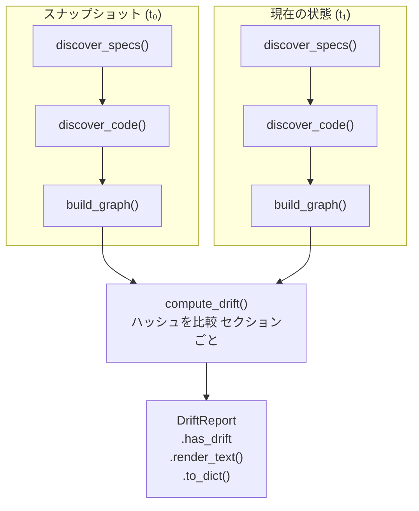

# ドリフト検出

> **日付:** 2026-07-26
> **バージョン:** 0.0.1.dev0

## 1. 概要
<!-- @impl specbridge/adapters/heuristic.py::HeuristicAdapter -->
<!-- @impl specbridge/analyzers/drift.py -->
<!-- @impl specbridge/analyzers/drift.py::build_snapshot -->
<!-- @impl tests/test_drift.py::TestDriftCompute -->

specbridgeは、保存されたスナップショットと現在のプロジェクト状態の間の変更を特定するためのドリフト検出を提供します。これにより、CIゲート（「仕様にドリフトがあるか？」）、プレコミット検証、および変更影響分析が可能になります。



## 2. スナップショットモデル

スナップショットは `.specbridge/snapshot.json` に保存されるJSONファイルです。以下をキャプチャします：

### スナップショット構造

```json
{
  "timestamp": "2026-07-26T14:30:00",
  "reason": "リファクタリング前のベースライン",
  "specs": [
    {
      "id": "auth.auth.1.1",
      "file": "docs/auth/auth.md",
      "title": "ユーザー認証",
      "heading_text": "1.1 User Authentication",
      "depth": 2,
      "line": 3,
      "body_hash": "a1b2c3d4e5f6a7b8",         // 見出し+本文のSHA256[:16]
      "body_hash_content": "b2c3d4e5f6a7b8c9",  // 本文のみのSHA256[:16]
      "body_line_count": 15,
      "body_preview": "システムはメールとパスワードでユーザー認証を行う..."
    }
  ],
  "code": [
    {
      "file": "src/auth/login.py",
      "module": "auth",
      "symbols": ["login", "authenticate", "validate_password"],
      "is_test": false,
      "language": "Python",
      "imports": ["flask", "sqlalchemy"],
      "file_hash": "c3d4e5f6a7b8c9d0",         // ファイル全体のSHA256[:16]
      "functions": [
        {
          "name": "login",
          "kind": "function",
          "line": 10,
          "body_hash": "d4e5f6a7b8c9d0e1",     // 関数本文のSHA256[:16]
          "body_lines": 25
        }
      ]
    }
  ],
  "orphan_spec_ids": ["auth.auth.2.1"],
  "coverage": {
    "total": 5,
    "covered": 4,
    "orphan": 1,
    "coverage_pct": 80.0,
    "spec_count": 5,
    "code_count": 12
  }
}
```

### ハッシュ戦略
<!-- @impl specbridge/analyzers/drift.py -->
<!-- @impl specbridge/analyzers/drift.py::build_snapshot -->
<!-- @impl specbridge/analyzers/drift.py::compute_drift -->
<!-- @impl tests/test_analyzers.py::three_spec_graph -->

詳細な変更検出のための3層のハッシュ：

| レベル | 対象 | ハッシュアルゴリズム | 用途 |
|-------|------|---------------------|------|
| **セクション** | 仕様の見出し+本文 | SHA256[:16] | 仕様内容の変更検出 |
| **セクション（見出しなし）** | 本文のみ | SHA256[:16] | リネーム検出（同じ本文、移動した見出し） |
| **ファイル** | コードファイル全体 | SHA256[:16] | コードファイルの変更検出 |
| **関数** | 関数/クラスの本文 | SHA256[:16] | 関数単位の変更検出 |

16文字の16進数トランケーションは、スナップショットサイズを管理可能に保ちながら、意味のある変更を検出するのに十分です。

## 3. ドリフト比較: `compute_drift()`

```python
def compute_drift(
    snapshot: dict,
    directory: str,
    *,
    spec_dirs: list[str] | None = None,
    source_dirs: list[str] | None = None,
) -> DriftReport:
```

### 3.1 仕様比較

スナップショット内の各仕様について、現在の状態と比較：

1. **削除**: スナップショットにはあるが現在の状態にはない仕様ID
2. **追加**: 現在の状態にはあるがスナップショットにはない仕様ID
3. **タイトル変更**: 同じID、異なる `title`
4. **本文変更**: 同じID、同じタイトル、異なる `body_hash`
5. **リネーム**: 同じ `body_hash_content` だが異なる auto_id（削除＋追加のペア）

### 3.2 コード比較

スナップショット内の各コードファイルについて、現在の状態と比較：

1. **削除**: スナップショットにはあるがディスク上にないファイルパス
2. **追加**: ディスク上にあるがスナップショットにないファイルパス
3. **シンボル変更**: 同じファイル、異なる抽出シンボルのセット
4. **関数本文変更**: 同じ関数名、異なる `body_hash`
5. **ファイルハッシュ変更**: シンボル変更なしで異なる `file_hash`（内容のみの編集）

### 3.3 リネーム検出アルゴリズム

```python
# body_hash_content の一致でリネームを検出
# 削除 + 同じ body_hash_content で追加 = リネーム
removed_by_hash = {s["body_hash_content"]: s for s in specs_removed
                   if s.get("body_hash_content")}
for added in specs_added:
    match = removed_by_hash.get(added.get("body_hash_content"))
    if match:
        specs_renamed.append({...})
    else:
        truly_added.append(added)
```

### 3.4 孤立 / カバレッジ差分

仕様とコードの比較後、関数は現在の状態のヒューリスティックグラフを再構築して以下を計算：

- 新しい孤立仕様（以前はカバーされていたが、現在は孤立）
- 解決された孤立仕様（以前は孤立していたが、現在はカバー）
- カバレッジ率 前 → 後（差分付き）

## 4. DriftReport

比較結果は以下の変更カテゴリを持つ `DriftReport` オブジェクトです：

| カテゴリ | フィールド | 説明 |
|----------|-----------|------|
| **仕様** | `specs_added` | 新しい仕様セクション |
| | `specs_removed` | 削除された仕様セクション |
| | `specs_changed` | タイトル変更 |
| | `specs_body_changed` | 本文内容の変更（同じタイトル） |
| | `specs_renamed` | 内容は保存、ID/タイトルが変更 |
| **コード** | `code_added` | 新しいソースファイル |
| | `code_removed` | 削除されたソースファイル |
| | `code_symbols_changed` | シンボルの追加/削除 |
| | `code_funcs_changed` | 関数本文のハッシュ変更 |
| **カバレッジ** | `new_orphan_specs` | すべての実装を失った仕様 |
| | `resolved_orphan_specs` | 実装を得た仕様 |
| | `new_orphan_code` | 仕様参照がないコードファイル |
| | `resolved_orphan_code` | 仕様参照を得たコードファイル |
| | `coverage_before` / `coverage_after` | 全体のカバレッジ統計 |

## 5. コマンド

### `specbridge snapshot`

現在のプロジェクト状態の新しいスナップショットを取得します。

```
$ specbridge snapshot --dir . --reason "リファクタリング前のベースライン"
📸 Snapshotting /Users/me/project ...
   Specs: 12 | Code files: 45
   Coverage: 83.3%
   Saved: .specbridge/snapshot.json
```

### `specbridge drift`

現在の状態を保存されたスナップショットと比較します。

```
$ specbridge drift
📄  New specs (2):
     + auth.auth.3: Password Reset  (docs/auth/password.md)
🗑️  Removed specs (1):
     - auth.auth.1.3: Deprecated Feature  (docs/auth/auth.md)
⚡  Changed function bodies (1):
     ~ src/auth/login.py
         login  (function:10)  hash: a1b2... → c3d4...
📈  Coverage: 83.3% → 75.0%  (-8.3%)
```

### `specbridge drift --git-base`

スナップショットを使わずにgitベースの変更を比較します。スナップショットベースのドリフトの代替手段：

```
$ specbridge drift --git-base main
⚠️  3 spec-affecting change(s):
   src/auth/login.py → affects spec auth.auth.1.1
   tests/test_auth.py → affects spec auth.auth.1.2
```

### `specbridge drift --gate`

ドリフトが検出された場合に終了コード1で終了します。CIパイプラインに便利：

```yaml
# GitHub Actions
- run: specbridge snapshot
- run: specbridge drift --gate
```

## 6. Gitベースのドリフト（`_drift_git()`）

スナップショットの代わりに `git diff --name-only <base>` を使用する代替ドリフトパス：

```
1. git diff --name-only base_ref → 変更されたファイルのリスト
2. フル分析を実行（アダプタ検出 → 分析 → TraceGraph）
3. 変更された各ファイルについて、仕様を実装しているか確認
4. 仕様に影響する変更のみを報告
```

これはスナップショット比較より軽量ですが（ハッシュ比較なし）、*どの*仕様が影響を受けたかのみを伝え、*どのように*影響を受けたか（タイトル変更、本文変更など）は伝えません。

## 7. エッジケース

| 状況 | 動作 |
|------|------|
| **スナップショットがない** | `drift` がエラー：「最初に `specbridge snapshot` を実行してください」 |
| **スナップショットファイルが破損** | `load_snapshot()` が `None` を返し、エラーをトリガー |
| **ファイルのリネーム** | コードファイルはパスで照合；リネームは削除＋追加として表示 |
| **仕様のリネーム** | `body_hash_content` のマッチングで検出 |
| **再スキャン時にプロジェクトが空** | すべての仕様/コードが削除として表示 |
| **変更のないgitベース** | 「変更は検出されませんでした」 |
| **異なるディレクトリからのスナップショット** | 構造に互換性があれば動作（これに対するガードはなし） |
