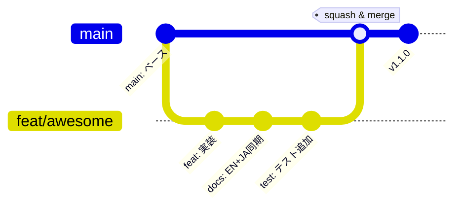
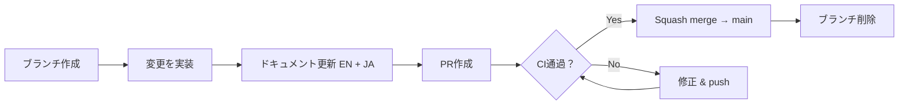
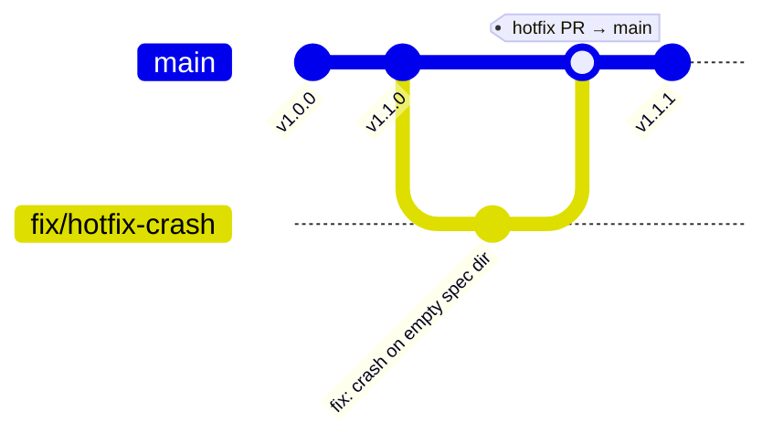

# ブランチ戦略

> **日付:** 2026-07-28
> **バージョン:** 1.0.0

## 1. 概要

specbridgeは **trunk-based development**（幹線開発）モデルを採用し、短命なトピックブランチを使用します。`main` ブランチは常にリリース可能な状態を維持し、すべての品質ゲート（テスト、lint、型チェック、トレーサビリティドリフト）を通過する必要があります。

この戦略はアルファ/ベータフェーズの単一開発者プロジェクト向けに設計されています。オーバーヘッドを抑えつつ、コード品質とトレーサビリティ規律を維持します。



## 2. 永続ブランチ

| ブランチ | 目的 | 保護 |
|---------|------|------|
| `main` | 常にリリース可能。全CIゲート通過必須。 | 保護 — 直接push禁止 |

永続ブランチは1つのみです。すべての開発は短命なトピックブランチで行われ、プルリクエスト経由で `main` にマージされます。

## 3. ブランチ命名規則

| プレフィックス | 対象 | コミット種別 |
|--------------|------|------------|
| `feat/<説明>` | 新機能、ユーザー向け変更 | `feat:` |
| `fix/<説明>` | バグ修正 | `fix:` |
| `chore/<説明>` | CI、メンテナンス、リファクタリング | `chore:` / `refactor:` |
| `docs/<説明>` | ドキュメントのみの変更 | `docs:` |
| `dependabot/**` | Dependabotによる自動生成 | `chore:` |

説明には **kebab-case** を使用します。ブランチは短く焦点を絞り、1ブランチ = 1論理変更とします。

例:
- `feat/graphify-adapter`
- `fix/setup-installer-bugs`
- `chore/pre-commit-docs-check`
- `docs/branching-strategy`

## 4. ワークフロー



### 4.1 ブランチ作成

常に最新の `main` からブランチを作成:

```bash
git checkout main
git pull
git checkout -b feat/my-feature
```

### 4.2 変更を実装

[AGENTS.md](../AGENTS.md) のワークフローに従います:

1. コード変更
2. 📚 **ドキュメント同期（EN + JA）** — コミット前に必須
3. Hermesに関連する変更がある場合はSKILL.mdを更新
4. `specbridge drift --gate` でトレーサビリティを確認
5. `pytest tests/ -q && mypy specbridge/ --strict` を実行

### 4.3 プルリクエストを作成

単一開発者の変更も含め、すべての変更はPR経由で行います。これにより:

- CIが自動実行される（テスト + lint + 型チェック + trace gate）
- トレーサビリティゲートがmainへのドリフトを防ぐ
- squash mergeでmainの履歴がクリーンに保たれる
- 変更が後からレビュー可能になる

PRのタイトルは conventional commit 形式にします:

```
feat: add graphify adapter for deep AST analysis (#45)
fix: resolve setup script path resolution on MacOS (#42)
docs: document branching strategy (#12)
```

### 4.4 マージ & クリーンアップ

常に **squash merge** で `main` にマージし、ブランチを削除します:

```bash
# GitHub PR画面から実行
# マージ後にローカルブランチを削除
git checkout main
git pull
git branch -d feat/my-feature
```

## 5. 直接pushの例外

単一開発者プロジェクトで過度な官僚主義は避けるべきです。以下の変更はPRなしで `main` に直接pushして構いません:

| 変更種別 | 例 | 条件 |
|---------|-----|------|
| タイポ修正 | READMEのtypo、コメント修正 | CI通過、コードロジック変更なし |
| CI設定 | ワークフローYAMLの調整 | 動作確認済み |
| ドキュメント | 軽微なドキュメント修正 | 仕様内容の変更なし、フォーマットのみ |

**PR必須** の変更:
- specbridgeのソースコード (`specbridge/`) の変更
- テストロジック (`tests/`) の変更
- トレーサビリティに影響する変更（仕様内容、コード-仕様マッピング）
- 新機能または修正
- trace gateの通過が必要な変更

迷ったら **PRを作成します**。どちらにせよCIは実行されます。

## 6. リリースプロセス

### 6.1 バージョニング

specbridgeは **セマンティックバージョニング** (semver) に従います:

| バージョン | フェーズ | 例 |
|-----------|---------|-----|
| `0.x.0` | 初期開発（pre-1.0） | `0.2.0` |
| `1.x.x` | 安定API | `1.1.0` |
| `x.x.y-pre` | プレリリース | `1.1.0-alpha.1` |

### 6.2 タグ付け

リリースは `main` にタグを付けます:

```bash
git tag -a v1.1.0 -m "v1.1.0 — Graphify adapter integration"
git push origin v1.1.0
```

### 6.3 CHANGELOG

リリースごとに主要な変更をまとめた `CHANGELOG.md` を管理します:

```
# Changelog

## v1.1.0 (2026-07-28)

### Added
- Graphify adapter for deep AST-based code graph (#45)

### Fixed
- Setup script path resolution on macOS (#42)

### Changed
- Upgraded CI to actions/checkout@v7
```

Conventional commit形式のコミットメッセージがあれば、CHANGELOG生成が容易になります。

## 7. ホットフィックスフロー

リリース済みバージョンの緊急修正:

1. タグからブランチ作成: `git checkout -b fix/hotfix-description v1.1.0`
2. 修正を適用
3. PR → CI → squash mergeで `main` にマージ
4. 新しいパッチバージョンをタグ付け: `git tag -a v1.1.1 -m "v1.1.1 — ..."`



## 8. CIゲート

`main` へのPRは以下をトリガーします:

1. **ci.yml** — Ruff lint → mypy型チェック → pytest（3種のPythonバージョン）
2. **specbridge-trace.yml** — スナップショット → ドリフトゲート → カバレッジレポート → HTMLトレースアーティファクト

すべてグリーンになるまでマージできません。

## 9. ブランチ保護ルール（GitHub）

`main` の推奨設定:

- ☐ マージ前にプルリクエストを必須にする
- ☐ ステータスチェックを必須にする（ci / test, trace / trace-gate）
- ☐ ブランチが最新であることを必須にする
- ☐ バイパスを許可しない（単一開発者の場合は緩和可）
- ☐ 管理者も含める

*(公開時に設定。プライベートベータでは任意。)*
